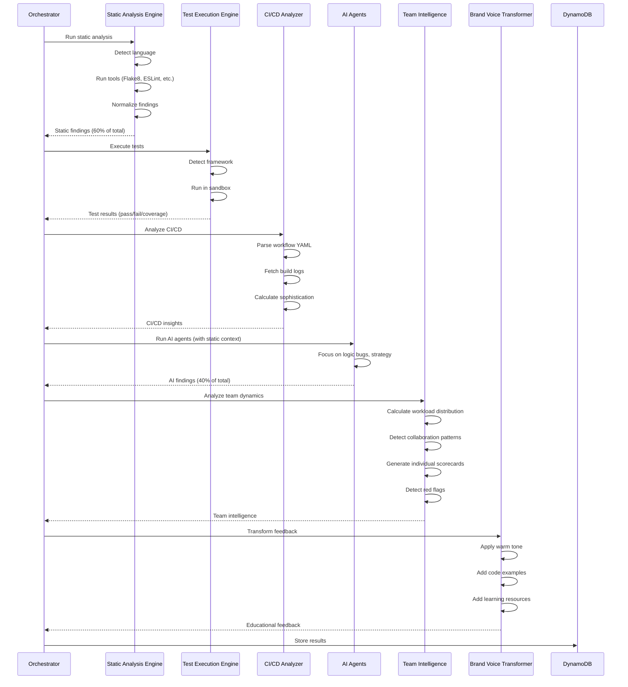

# Design Document: Human-Centric Intelligence Enhancement

## Overview

This feature transforms VibeJudge AI from a code auditor into a human-centric hackathon intelligence platform by adding two critical enhancement layers:

1. **Technical Foundation (Hybrid Architecture)**: Integrate free static analysis tools, deep CI/CD analysis, and actual test execution to reduce AI costs by 42% while increasing findings by 3x
2. **Human Intelligence Layer**: Add team dynamics analysis, individual contributor recognition, strategic thinking detection, and brand voice transformation

### Goals

- Reduce per-repository analysis cost from $0.086 to $0.050 (42% reduction)
- Increase findings from ~15 to ~45 per repository (3x improvement)
- Complete analysis within 90 seconds per repository
- Maintain 95%+ evidence verification rate
- Provide hiring intelligence for organizers
- Provide personalized growth feedback for participants
- Transform brand voice from cold technical criticism to warm educational mentorship

### Non-Goals

- Real-time analysis (batch processing only)
- Frontend dashboard (API-first MVP)
- Email notifications
- PDF report generation
- Integration with platforms other than GitHub

## Architecture

### System Components

The feature adds five new major components to the existing VibeJudge architecture:

```
┌─────────────────────────────────────────────────────────────────┐
│                      Analysis Orchestrator                       │
│                    (existing, enhanced)                          │
└────────────┬────────────────────────────────────────────────────┘
             │
             ├──────────────────────────────────────────────────┐
             │                                                  │
┌────────────▼──────────┐                    ┌─────────────────▼──────────┐
│  Static Analysis      │                    │   AI Agents                │
│  Engine (NEW)         │                    │   (existing, enhanced)     │
│                       │                    │                            │
│  - Language Detection │                    │  - BugHunter (scope ↓)    │
│  - Tool Orchestration │                    │  - Performance (scope ↓)  │
│  - Result Normalization│                   │  - Innovation (enhanced)  │
│  - Evidence Validation│                    │  - AIDetection (enhanced) │
└────────────┬──────────┘                    └─────────────────┬──────────┘
             │                                                  │
             │                                                  │
┌────────────▼──────────────────────────────────────────────────▼──────────┐
│                     Team Intelligence Layer (NEW)                         │
│                                                                            │
│  ┌──────────────────┐  ┌──────────────────┐  ┌──────────────────┐       │
│  │  Team Analyzer   │  │ Strategy Detector│  │ Brand Voice      │       │
│  │                  │  │                  │  │ Transformer      │       │
│  │ - Workload Dist  │  │ - Test Strategy  │  │ - Warm Tone      │       │
│  │ - Collaboration  │  │ - Architecture   │  │ - Code Examples  │       │
│  │ - Red Flags      │  │ - Trade-offs     │  │ - Learning Paths │       │
│  │ - Individual     │  │ - Context        │  │ - Effort Est.    │       │
│  │   Recognition    │  │   Detection      │  │                  │       │
│  └──────────────────┘  └──────────────────┘  └──────────────────┘       │
└────────────┬───────────────────────────────────────────────────────────┘
             │
┌────────────▼──────────────────────────────────────────────────────────┐
│              Organizer Intelligence Dashboard (NEW)                    │
│                                                                        │
│  - Hiring Intelligence (by role, seniority)                           │
│  - Technology Trends (popular stacks, emerging tech)                  │
│  - Common Issues (workshop recommendations)                           │
│  - Prize Recommendations (evidence-based)                             │
└────────────────────────────────────────────────────────────────────────┘
```

### Data Flow



### Integration Points

1. **Analysis Orchestrator** (`src/analysis/orchestrator.py`)
   - Enhanced to run static analysis before AI agents
   - Passes static findings as context to AI agents
   - Coordinates team intelligence analysis
   - Triggers brand voice transformation

2. **Agent Prompts** (`src/prompts/`)
   - Modified to receive static analysis context
   - Reduced scope to avoid duplicate work
   - Enhanced to detect strategic thinking

3. **Data Models** (`src/models/`)
   - New models for static analysis findings
   - New models for team dynamics
   - New models for individual scorecards
   - Enhanced evidence models with verification status

4. **API Routes** (`src/api/routes/`)
   - New endpoint: `GET /api/v1/hackathons/{hack_id}/intelligence` (organizer dashboard)
   - New endpoint: `GET /api/v1/submissions/{sub_id}/individual-scorecards`
   - Enhanced: `GET /api/v1/submissions/{sub_id}/scorecard` (includes team dynamics)

## Components and Interfaces

### 1. Static Analysis Engine

**Module**: `src/analysis/static_analysis_engine.py`

**Responsibilities**:
- Detect primary programming language from repository
- Orchestrate execution of language-specific static analysis tools
- Normalize findings into consistent evidence format
- Validate evidence citations (file exists, line number valid)
- Handle tool timeouts and missing tools gracefully

**Interface**:

```python
class StaticAnalysisEngine:
    """Orchestrates static analysis tools for multiple languages."""

    def analyze(self, repo_path: str, timeout_seconds: int = 30) -> StaticAnalysisResult:
        """Run static analysis on repository.

        Args:
            repo_path: Path to cloned repository
            timeout_seconds: Timeout per tool

        Returns:
            StaticAnalysisResult with normalized findings
        """

    def _detect_language(self, repo_path: str) -> PrimaryLanguage:
        """Detect primary language from file extensions."""

    def _run_python_tools(self, repo_path: str) -> list[StaticFinding]:
        """Run Flake8, Bandit, Safety, Radon."""

    def _run_javascript_tools(self, repo_path: str) -> list[StaticFinding]:
        """Run ESLint, npm audit, Prettier."""

    def _run_go_tools(self, repo_path: str) -> list[StaticFinding]:
        """Run go vet, staticcheck."""

    def _run_rust_tools(self, repo_path: str) -> list[StaticFinding]:
        """Run clippy, cargo audit."""

    def _normalize_finding(self, tool_output: dict, tool_name: str) -> StaticFinding:
        """Convert tool-specific output to normalized format."""

    def _validate_evidence(self, finding: StaticFinding, repo_path: str) -> bool:
        """Verify file and line number exist."""
```

**Tool Configuration**:

```python
STATIC_TOOLS = {
    "python": [
        {"name": "flake8", "cmd": "flake8 --format=json", "timeout": 30},
        {"name": "bandit", "cmd": "bandit -r -f json", "timeout": 30},
        {"name": "safety", "cmd": "safety check --json", "timeout": 20},
        {"name": "radon", "cmd": "radon cc -j", "timeout": 20},
    ],
    "javascript": [
        {"name": "eslint", "cmd": "eslint --format=json", "timeout": 30},
        {"name": "npm_audit", "cmd": "npm audit --json", "timeout": 20},
    ],
    "go": [
        {"name": "go_vet", "cmd": "go vet ./...", "timeout": 30},
        {"name": "staticcheck", "cmd": "staticcheck ./...", "timeout": 30},
    ],
    "rust": [
        {"name": "clippy", "cmd": "cargo clippy --message-format=json", "timeout": 30},
        {"name": "cargo_audit", "cmd": "cargo audit --json", "timeout": 20},
    ],
}
```

### 2. Test Execution Engine

**Module**: `src/analysis/test_execution_engine.py`

**Responsibilities**:
- Detect test framework from repository structure
- Execute tests in sandboxed environment
- Parse test output (pass/fail/skip counts)
- Extract coverage data if available
- Handle timeouts and missing dependencies

**Interface**:

```python
class TestExecutionEngine:
    """Executes tests in sandboxed environment."""

    def execute_tests(self, repo_path: str, timeout_seconds: int = 60) -> TestExecutionResult:
        """Run tests and capture results.

        Args:
            repo_path: Path to cloned repository
            timeout_seconds: Timeout for test execution

        Returns:
            TestExecutionResult with pass/fail counts
        """

    def _detect_framework(self, repo_path: str) -> TestFramework | None:
        """Detect test framework from config files."""

    def _run_pytest(self, repo_path: str) -> TestExecutionResult:
        """Run pytest with JSON output."""

    def _run_jest(self, repo_path: str) -> TestExecutionResult:
        """Run jest with JSON output."""

    def _run_go_test(self, repo_path: str) -> TestExecutionResult:
        """Run go test with JSON output."""

    def _install_dependencies(self, repo_path: str, framework: TestFramework) -> bool:
        """Attempt to install test dependencies."""

    def _parse_coverage(self, coverage_file: str) -> dict[str, float]:
        """Parse coverage report."""
```

### 3. CI/CD Deep Analyzer

**Module**: `src/analysis/cicd_analyzer.py` (enhanced)

**Responsibilities**:
- Parse GitHub Actions workflow YAML files
- Fetch and parse build logs from recent runs
- Extract test results and linter output from logs
- Calculate CI sophistication score
- Handle API rate limits with retry logic

**Interface**:

```python
class CICDAnalyzer:
    """Analyzes CI/CD sophistication and extracts insights."""

    def analyze(self, repo_data: RepoData, github_client: GitHubClient) -> CICDAnalysisResult:
        """Analyze CI/CD setup and history.

        Args:
            repo_data: Repository data with workflow info
            github_client: GitHub API client

        Returns:
            CICDAnalysisResult with sophistication score
        """

    def _parse_workflow_yaml(self, workflow_content: str) -> WorkflowConfig:
        """Parse workflow YAML to detect job types."""

    def _fetch_build_logs(self, repo_url: str, run_ids: list[str]) -> list[BuildLog]:
        """Fetch logs for recent workflow runs."""

    def _extract_test_results(self, log_content: str) -> TestResults:
        """Parse test output from build logs."""

    def _extract_linter_output(self, log_content: str) -> list[LinterFinding]:
        """Parse linter errors from build logs."""

    def _calculate_sophistication(self, workflow: WorkflowConfig) -> CISophisticationScore:
        """Calculate CI sophistication score."""
```

### 4. Team Analyzer

**Module**: `src/analysis/team_analyzer.py`

**Responsibilities**:
- Calculate workload distribution across contributors
- Detect collaboration patterns (pair programming, code review)
- Identify red flags (ghost contributors, extreme imbalance)
- Generate individual contributor scorecards
- Detect work patterns (late-night coding, panic pushes)

**Interface**:

```python
class TeamAnalyzer:
    """Analyzes team dynamics and individual contributions."""

    def analyze(self, repo_data: RepoData) -> TeamAnalysisResult:
        """Analyze team dynamics from git history.

        Args:
            repo_data: Repository data with commit history

        Returns:
            TeamAnalysisResult with dynamics and scorecards
        """

    def _calculate_workload_distribution(self, commits: list[Commit]) -> dict[str, float]:
        """Calculate percentage of commits per contributor."""

    def _detect_collaboration_patterns(self, commits: list[Commit]) -> list[CollaborationPattern]:
        """Detect pair programming, code review patterns."""

    def _detect_red_flags(self, commits: list[Commit], contributors: list[str]) -> list[RedFlag]:
        """Identify concerning team dynamics."""

    def _generate_individual_scorecard(
        self,
        contributor: str,
        commits: list[Commit],
        files_touched: list[str]
    ) -> IndividualScorecard:
        """Generate detailed scorecard for contributor."""

    def _detect_role(self, files_touched: list[str]) -> ContributorRole:
        """Detect role from file patterns."""

    def _detect_expertise(self, commits: list[Commit]) -> list[ExpertiseArea]:
        """Identify expertise areas from commit content."""

    def _generate_hiring_signals(self, scorecard: IndividualScorecard) -> HiringSignals:
        """Generate hiring recommendations."""
```

### 5. Strategy Detector

**Module**: `src/analysis/strategy_detector.py`

**Responsibilities**:
- Analyze test strategy (unit vs integration vs e2e)
- Detect critical path prioritization
- Identify architecture trade-offs
- Recognize demo-first vs production-first strategies
- Provide strategic context for scoring decisions

**Interface**:

```python
class StrategyDetector:
    """Detects strategic thinking behind technical decisions."""

    def analyze(
        self,
        repo_data: RepoData,
        test_results: TestExecutionResult,
        static_findings: StaticAnalysisResult
    ) -> StrategyAnalysisResult:
        """Analyze strategic decisions.

        Args:
            repo_data: Repository data
            test_results: Test execution results
            static_findings: Static analysis findings

        Returns:
            StrategyAnalysisResult with context
        """

    def _analyze_test_strategy(self, test_results: TestExecutionResult) -> TestStrategy:
        """Classify test strategy (unit/integration/e2e focus)."""

    def _detect_critical_path_focus(self, test_files: list[str]) -> bool:
        """Check if tests focus on critical paths."""

    def _detect_architecture_tradeoffs(self, repo_data: RepoData) -> list[Tradeoff]:
        """Identify speed vs security, simplicity vs scalability."""

    def _detect_learning_journey(self, commits: list[Commit]) -> LearningJourney | None:
        """Detect if team learned new tech during hackathon."""

    def _classify_maturity(self, strategy: StrategyAnalysisResult) -> MaturityLevel:
        """Classify as junior (tutorial-following) or senior (production thinking)."""
```

### 6. Brand Voice Transformer

**Module**: `src/analysis/brand_voice_transformer.py`

**Responsibilities**:
- Transform cold technical findings into warm educational feedback
- Add code examples (vulnerable vs fixed)
- Include learning resources (documentation, tutorials)
- Provide effort estimates and difficulty levels
- Follow pattern: Acknowledge → Explain Context → Show Fix → Explain Why → Provide Resources

**Interface**:

```python
class BrandVoiceTransformer:
    """Transforms technical findings into educational feedback."""

    def transform_findings(
        self,
        findings: list[Finding],
        strategy_context: StrategyAnalysisResult
    ) -> list[ActionableFeedback]:
        """Transform findings into actionable feedback.

        Args:
            findings: Raw technical findings
            strategy_context: Strategic context for scoring

        Returns:
            List of actionable feedback items
        """

    def _transform_security_finding(self, finding: Finding) -> ActionableFeedback:
        """Transform security issue with warm tone."""

    def _generate_code_example(self, finding: Finding) -> CodeExample:
        """Generate before/after code example."""

    def _add_learning_resources(self, finding: Finding) -> list[LearningResource]:
        """Add relevant documentation and tutorials."""

    def _estimate_effort(self, finding: Finding) -> EffortEstimate:
        """Estimate time and difficulty."""

    def _explain_business_impact(self, finding: Finding) -> str:
        """Explain why this matters for business."""
```

### 7. Organizer Intelligence Dashboard

**Module**: `src/services/organizer_intelligence_service.py`

**Responsibilities**:
- Aggregate insights across all submissions
- Generate hiring intelligence by role
- Identify technology trends
- Recommend workshops based on common issues
- Provide prize recommendations with evidence

**Interface**:

```python
class OrganizerIntelligenceService:
    """Generates organizer intelligence dashboard."""

    def generate_dashboard(self, hack_id: str) -> OrganizerDashboard:
        """Generate intelligence dashboard for hackathon.

        Args:
            hack_id: Hackathon ID

        Returns:
            OrganizerDashboard with aggregated insights
        """

    def _aggregate_top_performers(self, submissions: list[Submission]) -> list[TopPerformer]:
        """Identify top teams with key strengths."""

    def _generate_hiring_intelligence(self, scorecards: list[IndividualScorecard]) -> HiringIntelligence:
        """Categorize candidates by role and seniority."""

    def _analyze_technology_trends(self, submissions: list[Submission]) -> TechnologyTrends:
        """Identify popular stacks and emerging tech."""

    def _identify_common_issues(self, findings: list[Finding]) -> list[CommonIssue]:
        """Find patterns across submissions."""

    def _recommend_prizes(self, submissions: list[Submission]) -> list[PrizeRecommendation]:
        """Recommend prize winners with evidence."""
```

## Data Models

### Static Analysis Models

```python
class PrimaryLanguage(str, Enum):
    """Primary programming language."""
    PYTHON = "python"
    JAVASCRIPT = "javascript"
    TYPESCRIPT = "typescript"
    GO = "go"
    RUST = "rust"
    UNKNOWN = "unknown"

class StaticFinding(VibeJudgeBase):
    """Normalized finding from static analysis tool."""
    tool: str  # flake8, bandit, eslint, etc.
    file: str
    line: int | None = None
    code: str  # Error code (E501, B201, etc.)
    message: str
    severity: Severity
    category: str  # syntax | import | security | style | complexity
    recommendation: str
    verified: bool = False  # Evidence validation status

class StaticAnalysisResult(VibeJudgeBase):
    """Result from static analysis engine."""
    language: PrimaryLanguage
    tools_run: list[str]
    tools_failed: list[str]
    findings: list[StaticFinding]
    total_issues: int
    critical_issues: int
    duration_ms: int
```

### Test Execution Models

```python
class TestFramework(str, Enum):
    """Detected test framework."""
    PYTEST = "pytest"
    JEST = "jest"
    MOCHA = "mocha"
    VITEST = "vitest"
    GO_TEST = "go_test"
    UNKNOWN = "unknown"

class TestExecutionResult(VibeJudgeBase):
    """Result from test execution."""
    framework: TestFramework
    total_tests: int
    passed_tests: int
    failed_tests: int
    skipped_tests: int
    pass_rate: float  # passed / total
    coverage_by_file: dict[str, float] = Field(default_factory=dict)
    failing_tests: list[FailingTest] = Field(default_factory=list)
    duration_ms: int
    timed_out: bool = False
    dependencies_installed: bool = False

class FailingTest(VibeJudgeBase):
    """Details of a failing test."""
    name: str
    error_message: str
    file: str
    line: int | None = None
```

### CI/CD Models

```python
class WorkflowConfig(VibeJudgeBase):
    """Parsed GitHub Actions workflow configuration."""
    has_lint_job: bool = False
    has_test_job: bool = False
    has_build_job: bool = False
    has_deploy_job: bool = False
    has_caching: bool = False
    has_matrix_builds: bool = False
    job_count: int = 0

class CISophisticationScore(VibeJudgeBase):
    """CI sophistication scoring."""
    score: float = Field(..., ge=0, le=10)
    job_types_score: float  # 0-3 points
    optimization_score: float  # 0-3 points
    deployment_score: float  # 0-4 points
    rationale: str

class CICDAnalysisResult(VibeJudgeBase):
    """Result from CI/CD analysis."""
    workflow_configs: list[WorkflowConfig]
    sophistication: CISophisticationScore
    test_results_from_logs: TestResults | None = None
    linter_findings_from_logs: list[LinterFinding] = Field(default_factory=list)
    build_logs_analyzed: int
    duration_ms: int
```

### Team Dynamics Models

```python
class ContributorRole(str, Enum):
    """Detected contributor role."""
    BACKEND = "backend"
    FRONTEND = "frontend"
    DEVOPS = "devops"
    FULL_STACK = "full_stack"
    UNKNOWN = "unknown"

class ExpertiseArea(str, Enum):
    """Expertise area."""
    DATABASE = "database"
    SECURITY = "security"
    TESTING = "testing"
    API = "api"
    UI_UX = "ui_ux"
    INFRASTRUCTURE = "infrastructure"

class RedFlagSeverity(str, Enum):
    """Red flag severity."""
    CRITICAL = "critical"
    HIGH = "high"
    MEDIUM = "medium"

class RedFlag(VibeJudgeBase):
    """Concerning team dynamic pattern."""
    flag_type: str  # extreme_imbalance | ghost_contributor | history_rewriting | etc.
    severity: RedFlagSeverity
    description: str
    evidence: str  # Commit hashes, timestamps
    impact: str  # Why this matters
    hiring_impact: str  # Disqualifies from certain roles
    recommended_action: str

class CollaborationPattern(VibeJudgeBase):
    """Detected collaboration pattern."""
    pattern_type: str  # pair_programming | code_review | alternating_commits
    contributors: list[str]
    evidence: str
    positive: bool  # Is this a good pattern?

class IndividualScorecard(VibeJudgeBase):
    """Detailed assessment of individual contributor."""
    contributor_name: str
    contributor_email: str
    role: ContributorRole
    expertise_areas: list[ExpertiseArea]
    commit_count: int
    lines_added: int
    lines_deleted: int
    files_touched: list[str]
    notable_contributions: list[str]  # Commits with >500 insertions
    strengths: list[str]
    weaknesses: list[str]
    growth_areas: list[str]
    work_style: WorkStyle
    hiring_signals: HiringSignals

class WorkStyle(VibeJudgeBase):
    """Work style patterns."""
    commit_frequency: str  # frequent | moderate | infrequent
    avg_commit_size: int
    active_hours: list[int]  # Hours of day (0-23)
    late_night_commits: int  # 2am-6am
    weekend_commits: int

class HiringSignals(VibeJudgeBase):
    """Hiring recommendations."""
    recommended_role: str
    seniority_level: str  # junior | mid | senior
    salary_range_usd: str  # e.g., "$80k-$100k"
    must_interview: bool
    sponsor_interest: list[str]  # Which sponsors might be interested
    rationale: str

class TeamAnalysisResult(VibeJudgeBase):
    """Result from team dynamics analysis."""
    workload_distribution: dict[str, float]  # contributor -> percentage
    collaboration_patterns: list[CollaborationPattern]
    red_flags: list[RedFlag]
    individual_scorecards: list[IndividualScorecard]
    team_dynamics_grade: str  # A-F
    commit_message_quality: float  # 0-1
    panic_push_detected: bool
    duration_ms: int
```

### Strategy Models

```python
class TestStrategy(str, Enum):
    """Test strategy classification."""
    UNIT_FOCUSED = "unit_focused"
    INTEGRATION_FOCUSED = "integration_focused"
    E2E_FOCUSED = "e2e_focused"
    CRITICAL_PATH = "critical_path"
    DEMO_FIRST = "demo_first"
    NO_TESTS = "no_tests"

class MaturityLevel(str, Enum):
    """Team maturity level."""
    JUNIOR = "junior"  # Tutorial-following
    MID = "mid"  # Solid fundamentals
    SENIOR = "senior"  # Production thinking

class Tradeoff(VibeJudgeBase):
    """Detected architecture tradeoff."""
    tradeoff_type: str  # speed_vs_security | simplicity_vs_scalability
    decision: str  # What they chose
    rationale: str  # Why this makes sense for hackathon
    impact_on_score: str  # How this affects scoring

class LearningJourney(VibeJudgeBase):
    """Detected learning during hackathon."""
    technology: str
    evidence: list[str]  # Commit messages
    progression: str  # How they improved
    impressive: bool  # Is this noteworthy?

class StrategyAnalysisResult(VibeJudgeBase):
    """Result from strategy detection."""
    test_strategy: TestStrategy
    critical_path_focus: bool
    tradeoffs: list[Tradeoff]
    learning_journey: LearningJourney | None
    maturity_level: MaturityLevel
    strategic_context: str  # Overall context for scoring
    duration_ms: int
```

### Feedback Models

```python
class CodeExample(VibeJudgeBase):
    """Before/after code example."""
    vulnerable_code: str
    fixed_code: str
    explanation: str

class LearningResource(VibeJudgeBase):
    """Learning resource link."""
    title: str
    url: str
    resource_type: str  # documentation | tutorial | guide | video

class EffortEstimate(VibeJudgeBase):
    """Effort estimate for fix."""
    minutes: int
    difficulty: str  # Easy | Moderate | Advanced

class ActionableFeedback(VibeJudgeBase):
    """Transformed feedback item."""
    priority: int = Field(..., ge=1, le=5)
    finding: str
    acknowledgment: str  # What they did right
    context: str  # Why this is common in hackathons
    code_example: CodeExample | None
    why_vulnerable: str
    why_fixed: str
    testing_instructions: str
    learning_resources: list[LearningResource]
    effort_estimate: EffortEstimate
    business_impact: str
```

### Organizer Dashboard Models

```python
class TopPerformer(VibeJudgeBase):
    """Top performing team."""
    team_name: str
    sub_id: str
    overall_score: float
    key_strengths: list[str]
    sponsor_interest_flags: list[str]

class HiringIntelligence(VibeJudgeBase):
    """Hiring intelligence by role."""
    backend_candidates: list[IndividualScorecard]
    frontend_candidates: list[IndividualScorecard]
    devops_candidates: list[IndividualScorecard]
    full_stack_candidates: list[IndividualScorecard]
    must_interview: list[IndividualScorecard]

class TechnologyTrends(VibeJudgeBase):
    """Technology trend analysis."""
    most_used: list[tuple[str, int]]  # (technology, count)
    emerging: list[str]
    popular_stacks: list[tuple[str, int]]  # (stack combination, count)

class CommonIssue(VibeJudgeBase):
    """Common issue across submissions."""
    issue_type: str
    percentage_affected: float
    workshop_recommendation: str
    example_teams: list[str]

class PrizeRecommendation(VibeJudgeBase):
    """Prize recommendation with evidence."""
    prize_category: str
    recommended_team: str
    sub_id: str
    justification: str
    evidence: list[str]

class OrganizerDashboard(VibeJudgeBase):
    """Complete organizer intelligence dashboard."""
    hack_id: str
    hackathon_name: str
    total_submissions: int
    top_performers: list[TopPerformer]
    hiring_intelligence: HiringIntelligence
    technology_trends: TechnologyTrends
    common_issues: list[CommonIssue]
    standout_moments: list[str]
    prize_recommendations: list[PrizeRecommendation]
    next_hackathon_recommendations: list[str]
    sponsor_follow_up_actions: list[str]
```


## Correctness Properties

*A property is a characteristic or behavior that should hold true across all valid executions of a system—essentially, a formal statement about what the system should do. Properties serve as the bridge between human-readable specifications and machine-verifiable correctness guarantees.*

### Property Reflection

After analyzing all 133 acceptance criteria, I identified several areas of redundancy:

1. **Language-specific tool execution (1.1-1.4)** can be combined into one property: "For any repository, the correct tools for its primary language are executed"
2. **Threshold-based red flag detection (4.2-4.3, 8.1-8.2, 8.5)** can be combined into properties about threshold detection in general
3. **Parser properties (13.1-13.5)** can be combined into one property about parser normalization
4. **Evidence validation (1.10, 12.1-12.2)** are the same core property stated differently
5. **Feedback structure properties (11.1-11.8)** can be combined into one property about required feedback fields
6. **Brand voice pattern (7.1, 7.6, 7.11)** can be combined into one property about output structure

After consolidation, we have 54 unique, non-redundant properties.

### Property 1: Language-Specific Tool Execution

*For any* repository with a detectable primary language (Python, JavaScript, TypeScript, Go, Rust), the static analysis engine should execute all configured tools for that language and return findings from those tools.

**Validates: Requirements 1.1, 1.2, 1.3, 1.4**

### Property 2: Graceful Tool Degradation

*For any* static analysis tool that times out or is not installed, the system should continue with remaining tools and log the failure without crashing.

**Validates: Requirements 1.5, 1.6**

### Property 3: Finding Normalization

*For any* static analysis tool output, the normalized finding should contain all required fields: tool, file, line (optional), code, message, severity, category, recommendation.

**Validates: Requirements 1.7, 13.1, 13.2, 13.3**

### Property 4: Analysis Result Completeness

*For any* completed static analysis, the result should contain: total issue count, critical issue count, list of tools successfully run, and list of tools that failed.

**Validates: Requirements 1.8**

### Property 5: Static Analysis Performance

*For any* repository under 10,000 lines of code, static analysis should complete within 30 seconds.

**Validates: Requirements 1.9**

### Property 6: Evidence File Validation

*For any* finding that cites a file path, the file must exist in the repository, otherwise the finding should be marked as unverified.

**Validates: Requirements 1.10, 12.1, 12.3**

### Property 7: Evidence Line Validation

*For any* finding that cites a line number, the line number must be within the file's line count (1 to max_lines), otherwise the finding should be marked as unverified.

**Validates: Requirements 12.2, 12.4**

### Property 8: CI/CD Log Fetching

*For any* repository with GitHub Actions workflow runs, the system should fetch build logs for up to the most recent 5 runs.

**Validates: Requirements 2.1**

### Property 9: Test Output Parsing

*For any* build log containing test output, the parsed result should include pass count, fail count, and test names.

**Validates: Requirements 2.2, 13.4, 13.5**

### Property 10: Workflow YAML Parsing

*For any* valid GitHub Actions workflow YAML file, the parser should detect job types (lint, test, build, deploy), caching configuration, and matrix builds.

**Validates: Requirements 2.5, 2.6, 2.7**

### Property 11: CI Sophistication Scoring

*For any* parsed workflow configuration, the CI sophistication score should be calculated consistently based on job types, caching, matrix builds, and deployment automation, producing a score between 0 and 10.

**Validates: Requirements 2.8**

### Property 12: API Retry Logic

*For any* API call that fails with a rate limit error, the system should retry with exponential backoff up to 3 times before failing.

**Validates: Requirements 2.9**

### Property 13: CI/CD Analysis Performance

*For any* repository, CI/CD deep analysis should complete within 15 seconds.

**Validates: Requirements 2.10**

### Property 14: Test Framework Detection

*For any* repository containing framework-specific configuration files (pytest.ini, package.json with test script, go.mod), the system should correctly detect the test framework.

**Validates: Requirements 3.1, 3.2, 3.3**

### Property 15: Test Execution Sandboxing

*For any* detected test framework, tests should execute in an isolated /tmp directory with a 60-second timeout.

**Validates: Requirements 3.4, 3.8, 3.11**

### Property 16: Test Result Capture

*For any* test execution, the result should include total tests, passed tests, failed tests, skipped tests, and pass rate (passed/total).

**Validates: Requirements 3.5, 3.10**

### Property 17: Test Failure Details

*For any* failing test, the system should extract the test name, error message, file, and line number (if available).

**Validates: Requirements 3.6**

### Property 18: Dependency Installation Retry

*For any* test execution that fails due to missing dependencies, the system should attempt to install dependencies once before retrying.

**Validates: Requirements 3.9**

### Property 19: Workload Distribution Calculation

*For any* repository with multiple contributors, the workload distribution percentages should sum to 100% (within floating point tolerance).

**Validates: Requirements 4.1**

### Property 20: Threshold-Based Red Flag Detection

*For any* repository where a contributor exceeds a defined threshold (>80% commits = extreme imbalance, >70% = significant imbalance, 0 commits = ghost contributor, ≤2 commits in team of 3+ = minimal contribution, >10 late-night commits = unhealthy patterns, >5 force pushes = history rewriting), the appropriate red flag should be generated with correct severity.

**Validates: Requirements 4.2, 4.3, 4.5, 4.6, 8.1, 8.2, 8.3, 8.5**

### Property 21: Pair Programming Detection

*For any* commit history showing alternating commits between two contributors, the system should detect this as a pair programming collaboration pattern.

**Validates: Requirements 4.4**

### Property 22: Temporal Pattern Detection

*For any* repository where >40% of commits occur in the final hour before deadline, the system should flag this as a "panic push" time management issue.

**Validates: Requirements 4.8**

### Property 23: Commit Message Quality

*For any* repository, the commit message quality score should be calculated as the percentage of descriptive messages (>3 words, not starting with "fix"/"update"/"wip").

**Validates: Requirements 4.9**

### Property 24: Team Dynamics Evidence

*For any* team dynamics finding (red flag, collaboration pattern, workload imbalance), the finding should include specific evidence with commit hashes and timestamps.

**Validates: Requirements 4.11, 5.11**

### Property 25: Role Detection

*For any* contributor who touches files in 3 or more different domains (backend, frontend, infrastructure), the system should classify them as "Full-Stack".

**Validates: Requirements 5.1, 5.2**

### Property 26: Notable Contribution Detection

*For any* contributor, commits with >500 insertions or >10 files changed should be included in their notable contributions list.

**Validates: Requirements 5.4**

### Property 27: Individual Scorecard Completeness

*For any* contributor, their individual scorecard should contain all required sections: role, expertise areas, commit count, lines added/deleted, files touched, notable contributions, strengths, weaknesses, growth areas, work style, and hiring signals.

**Validates: Requirements 5.10**

### Property 28: Test Strategy Classification

*For any* repository with tests, the system should classify the test strategy based on test type distribution (unit/integration/e2e) and test file paths (critical path focus).

**Validates: Requirements 6.1, 6.2, 6.3, 6.5**

### Property 29: Learning Journey Detection

*For any* commit history containing keywords indicating learning ("first", "learning", "trying") combined with new framework file additions, the system should detect this as a learning journey.

**Validates: Requirements 6.7**

### Property 30: Strategic Context Output

*For any* strategy analysis result, the output should include a "What this reveals about the team" section explaining maturity level.

**Validates: Requirements 6.9**

### Property 31: Feedback Structure Pattern

*For any* transformed feedback item, the output should follow the pattern: Acknowledgment → Context → Code Example (if applicable) → Explanation → Resources, with strengths mentioned before weaknesses.

**Validates: Requirements 7.1, 7.2, 7.3, 7.4, 7.6, 7.11**

### Property 32: Feedback Completeness

*For any* actionable feedback item, it should include: priority (1-5), effort estimate (minutes), difficulty level (Easy/Moderate/Advanced), current code snippet (if applicable), fixed code snippet (if applicable), vulnerability explanation, fix explanation, testing instructions, and 2-3 learning resource links.

**Validates: Requirements 7.7, 7.8, 11.1, 11.2, 11.3, 11.4, 11.5, 11.6, 11.7, 11.8**

### Property 33: Red Flag Completeness

*For any* red flag, it should include: flag type, severity, description, evidence (commit hashes/timestamps), impact explanation, hiring impact assessment, and recommended action.

**Validates: Requirements 8.8, 8.9**

### Property 34: Critical Red Flag Recommendation

*For any* submission with critical severity red flags, the team analyzer should recommend disqualification from team awards while allowing individual assessment.

**Validates: Requirements 8.10**

### Property 35: Branch Analysis Red Flag

*For any* repository where all commits go directly to main with no branches or PRs, the system should flag "No code review culture" with medium severity.

**Validates: Requirements 8.7**

### Property 36: Dashboard Aggregation Completeness

*For any* hackathon with completed submissions, the organizer dashboard should include: top performers, hiring intelligence (categorized by role), technology trends, common issues with percentages, standout moments, prize recommendations, next hackathon recommendations, and sponsor follow-up actions.

**Validates: Requirements 9.1, 9.2, 9.3, 9.4, 9.5, 9.6, 9.7**

### Property 37: Infrastructure Maturity Metrics

*For any* hackathon, the dashboard should calculate infrastructure maturity metrics including CI/CD adoption rate, Docker usage rate, and monitoring/logging adoption rate across all submissions.

**Validates: Requirements 9.8**

### Property 38: Evidence-Based Prize Recommendations

*For any* prize recommendation in the dashboard, it should include specific team examples and evidence citations, not just scores.

**Validates: Requirements 9.9, 9.10**

### Property 39: Execution Order - Static Before AI

*For any* repository analysis, static analysis tools should execute before AI agents, and static analysis results should be passed as context to AI agents.

**Validates: Requirements 10.1, 10.3**

### Property 40: AI Agent Scope Reduction

*For any* repository analysis, AI agent findings should not duplicate issues already caught by static analysis (syntax errors, import errors, undefined variables).

**Validates: Requirements 10.2**

### Property 41: Cost Reduction Target

*For any* repository analysis, the total cost should be ≤$0.050 per repository (42% reduction from $0.086 baseline).

**Validates: Requirements 10.4**

### Property 42: Finding Distribution

*For any* repository analysis, the total findings should be approximately 3x the baseline (~45 findings), with roughly 60% from static tools and 40% from AI agents.

**Validates: Requirements 10.5**

### Property 43: Analysis Performance Target

*For any* repository, the complete hybrid analysis (static + test execution + CI/CD + AI agents + team intelligence) should complete within 90 seconds.

**Validates: Requirements 10.6**

### Property 44: Finding Prioritization

*For any* repository where static analysis finds >50 critical issues, the system should prioritize the top 20 for AI agent review to stay within token budget.

**Validates: Requirements 10.8**

### Property 45: Evidence Verification Rate

*For any* completed analysis, the evidence verification rate (verified findings / total findings × 100) should be ≥95%, and if it falls below 95%, a critical alert should be logged.

**Validates: Requirements 10.9, 12.5, 12.6, 12.7**

### Property 46: Verification Before Transformation

*For any* analysis pipeline, evidence validation should occur before findings are passed to the Brand Voice Transformer.

**Validates: Requirements 12.10**

### Property 47: Unverified Finding Exclusion

*For any* final scorecard, unverified findings (where file doesn't exist or line number is invalid) should be excluded.

**Validates: Requirements 12.9**

### Property 48: Finding Grouping

*For any* set of related findings (e.g., all authentication security issues), the system should group them into themes with a theme name.

**Validates: Requirements 11.9**

### Property 49: Personalized Learning Roadmap

*For any* contributor with identified weaknesses and growth areas, the system should generate a personalized learning roadmap.

**Validates: Requirements 11.10**

### Property 50: Malformed JSON Handling

*For any* static analysis tool that returns malformed JSON, the system should log a parse error and continue with remaining tools without crashing.

**Validates: Requirements 13.9**

### Property 51: Required Field Validation

*For any* parsed data structure (finding, test result, workflow config), the system should validate that all required fields exist before storing in the database.

**Validates: Requirements 13.10**

### Property 52: Round-Trip Serialization

*For any* data structure (StaticFinding, IndividualScorecard, OrganizerDashboard), the round-trip property should hold: parse(pretty_print(data)) produces an equivalent data structure.

**Validates: Requirements 13.11**

### Property 53: Cost Tracking Structure

*For any* completed analysis, the cost breakdown should include: static analysis cost ($0), per-agent AI costs with token counts, and total cost, all stored in DynamoDB.

**Validates: Requirements 10.7, 10.10**

### Property 54: Pretty Printer Format

*For any* data structure (evidence, scorecard, dashboard), the pretty printer should format it into structured markdown with appropriate sections and headings.

**Validates: Requirements 13.6, 13.7, 13.8**

## Error Handling

### Static Analysis Errors

1. **Tool Timeout**: If a static analysis tool exceeds 60 seconds, terminate the process, log the timeout, and continue with remaining tools
2. **Tool Not Installed**: If a tool is not found in PATH, log a warning and skip that tool gracefully
3. **Malformed Tool Output**: If tool output is not valid JSON, log parse error and skip that tool
4. **File System Errors**: If repository path is invalid or inaccessible, fail fast with clear error message

### Test Execution Errors

1. **Framework Detection Failure**: If no test framework is detected, skip test execution and log info message
2. **Test Timeout**: If tests exceed 60 seconds, terminate process and mark as incomplete
3. **Dependency Installation Failure**: If dependency installation fails after one retry, skip test execution and log error
4. **Sandbox Isolation Failure**: If /tmp directory creation fails, fail fast with error

### CI/CD Analysis Errors

1. **API Rate Limiting**: Retry with exponential backoff (2s, 4s, 8s) up to 3 times
2. **Workflow YAML Parse Error**: Log error and skip that workflow file
3. **Build Log Fetch Failure**: Log error and continue with available logs
4. **Log Parse Failure**: Log error and continue with remaining logs

### Team Analysis Errors

1. **Empty Commit History**: If repository has 0 commits, skip team analysis and log warning
2. **Single Contributor**: If repository has only 1 contributor, skip collaboration analysis but generate individual scorecard
3. **Invalid Commit Data**: If commit is missing required fields (author, timestamp), skip that commit and log warning

### Evidence Validation Errors

1. **File Not Found**: Mark finding as unverified, log error with file path
2. **Invalid Line Number**: Mark finding as unverified, log error with file and line
3. **Verification Rate Below Threshold**: If <95% verified, log critical alert for investigation

### AI Agent Errors

1. **Bedrock Throttling**: Retry with exponential backoff up to 3 times
2. **Bedrock Timeout**: Fail that agent but continue with other agents
3. **JSON Parse Failure**: Use retry prompt to request valid JSON, up to 2 retries
4. **Token Limit Exceeded**: Truncate context and retry once

### General Error Handling Principles

1. **Graceful Degradation**: Never let one component failure crash the entire analysis
2. **Structured Logging**: All errors logged with structured context (sub_id, component, error_type)
3. **Partial Results**: Return partial results if some components succeed
4. **Error Propagation**: Store error messages in submission record for debugging

## Testing Strategy

### Dual Testing Approach

This feature requires both unit tests and property-based tests for comprehensive coverage:

- **Unit tests**: Verify specific examples, edge cases, and error conditions
- **Property tests**: Verify universal properties across all inputs using randomized testing

### Unit Testing Focus

Unit tests should focus on:

1. **Specific Tool Integration**: Test that Flake8 parser correctly handles known Flake8 output format
2. **Edge Cases**: Test empty repositories, single-contributor teams, repositories with no tests
3. **Error Conditions**: Test timeout handling, missing tools, malformed JSON
4. **Integration Points**: Test that orchestrator correctly passes static results to AI agents
5. **Threshold Boundaries**: Test red flag detection at exact threshold values (80%, 70%, etc.)

### Property-Based Testing Configuration

- **Library**: Use `hypothesis` for Python property-based testing
- **Iterations**: Minimum 100 iterations per property test
- **Tagging**: Each property test must reference its design document property number

Example property test structure:

```python
from hypothesis import given, strategies as st
import pytest

@given(
    repo_path=st.text(min_size=1),
    language=st.sampled_from(["python", "javascript", "go", "rust"])
)
def test_property_1_language_specific_tool_execution(repo_path, language):
    """
    Feature: human-centric-intelligence, Property 1:
    For any repository with a detectable primary language, the static
    analysis engine should execute all configured tools for that language.
    """
    # Setup: Create mock repository with specified language
    # Execute: Run static analysis
    # Assert: Verify correct tools were executed for language
    pass
```

### Property Test Coverage

Each of the 54 correctness properties should have a corresponding property-based test:

1. **Properties 1-7**: Static analysis engine properties
2. **Properties 8-13**: CI/CD analysis properties
3. **Properties 14-18**: Test execution properties
4. **Properties 19-27**: Team dynamics and individual recognition properties
5. **Properties 28-30**: Strategy detection properties
6. **Properties 31-32**: Brand voice transformation properties
7. **Properties 33-35**: Red flag detection properties
8. **Properties 36-38**: Organizer dashboard properties
9. **Properties 39-47**: Hybrid architecture and cost optimization properties
10. **Properties 48-54**: Parsing, serialization, and output formatting properties

### Test Data Generation

For property-based tests, generate:

1. **Repositories**: Random file structures with various languages
2. **Commit Histories**: Random commit sequences with varying authors, timestamps, messages
3. **Tool Outputs**: Random but valid JSON outputs from static analysis tools
4. **Workflow YAML**: Random but valid GitHub Actions configurations
5. **Test Results**: Random test execution results with varying pass/fail ratios

### Integration Testing

Integration tests should verify:

1. **End-to-End Analysis**: Complete analysis pipeline from repository clone to final scorecard
2. **DynamoDB Storage**: Verify all results are correctly stored and retrievable
3. **API Endpoints**: Test new endpoints (intelligence dashboard, individual scorecards)
4. **Cost Tracking**: Verify cost calculations and storage
5. **Evidence Validation**: Verify validation occurs before transformation

### Performance Testing

Performance tests should verify:

1. **Static Analysis**: <30 seconds for repos under 10k lines
2. **CI/CD Analysis**: <15 seconds per repository
3. **Test Execution**: <60 seconds timeout enforced
4. **Full Analysis**: <90 seconds per repository
5. **Batch Processing**: 50 repositories in <30 minutes

### Test Organization

```
tests/
├── unit/
│   ├── test_static_analysis_engine.py
│   ├── test_test_execution_engine.py
│   ├── test_cicd_analyzer.py
│   ├── test_team_analyzer.py
│   ├── test_strategy_detector.py
│   ├── test_brand_voice_transformer.py
│   ├── test_organizer_intelligence_service.py
│   └── test_evidence_validation.py
├── property/
│   ├── test_properties_static_analysis.py  # Properties 1-7
│   ├── test_properties_cicd.py             # Properties 8-13
│   ├── test_properties_test_execution.py   # Properties 14-18
│   ├── test_properties_team_dynamics.py    # Properties 19-27
│   ├── test_properties_strategy.py         # Properties 28-30
│   ├── test_properties_brand_voice.py      # Properties 31-32
│   ├── test_properties_red_flags.py        # Properties 33-35
│   ├── test_properties_dashboard.py        # Properties 36-38
│   ├── test_properties_hybrid_arch.py      # Properties 39-47
│   └── test_properties_serialization.py    # Properties 48-54
├── integration/
│   ├── test_analysis_pipeline.py
│   ├── test_api_endpoints.py
│   └── test_cost_tracking.py
└── performance/
    ├── test_static_analysis_performance.py
    ├── test_full_analysis_performance.py
    └── test_batch_processing_performance.py
```

### Mocking Strategy

1. **Static Analysis Tools**: Mock tool execution to return predefined outputs
2. **GitHub API**: Mock API responses for workflow runs and build logs
3. **Test Execution**: Mock test framework execution to avoid actual test runs in unit tests
4. **Bedrock API**: Mock Bedrock responses for AI agent testing
5. **DynamoDB**: Use moto library for DynamoDB mocking

### Test Fixtures

Create reusable fixtures for:

1. **Sample Repositories**: Small git repositories with known characteristics
2. **Tool Outputs**: Valid JSON outputs from each static analysis tool
3. **Commit Histories**: Commit sequences demonstrating various patterns
4. **Workflow Configs**: GitHub Actions YAML files with various configurations
5. **Test Results**: Test execution results with various outcomes

## Implementation Approach

### Phase 1: Foundation (Week 1-2)

1. **Data Models**: Create all new Pydantic models in `src/models/`
   - `static_analysis.py`: StaticFinding, StaticAnalysisResult, PrimaryLanguage
   - `test_execution.py`: TestExecutionResult, TestFramework, FailingTest
   - `team_dynamics.py`: TeamAnalysisResult, IndividualScorecard, RedFlag, etc.
   - `strategy.py`: StrategyAnalysisResult, TestStrategy, Tradeoff, etc.
   - `feedback.py`: ActionableFeedback, CodeExample, LearningResource, etc.
   - `dashboard.py`: OrganizerDashboard, HiringIntelligence, TechnologyTrends, etc.

2. **Static Analysis Engine**: Implement `src/analysis/static_analysis_engine.py`
   - Language detection
   - Tool orchestration with timeout handling
   - Result normalization
   - Evidence validation

3. **Test Execution Engine**: Implement `src/analysis/test_execution_engine.py`
   - Framework detection
   - Sandboxed execution
   - Result parsing
   - Dependency installation

### Phase 2: Intelligence Layer (Week 3-4)

1. **Team Analyzer**: Implement `src/analysis/team_analyzer.py`
   - Workload distribution calculation
   - Collaboration pattern detection
   - Red flag detection
   - Individual scorecard generation

2. **Strategy Detector**: Implement `src/analysis/strategy_detector.py`
   - Test strategy classification
   - Critical path detection
   - Trade-off identification
   - Learning journey detection

3. **Brand Voice Transformer**: Implement `src/analysis/brand_voice_transformer.py`
   - Feedback transformation
   - Code example generation
   - Learning resource addition
   - Effort estimation

### Phase 3: Integration (Week 5)

1. **Orchestrator Enhancement**: Update `src/analysis/orchestrator.py`
   - Add static analysis step before AI agents
   - Add team intelligence step after AI agents
   - Add brand voice transformation step
   - Update cost tracking

2. **CI/CD Analyzer Enhancement**: Update `src/analysis/cicd_analyzer.py`
   - Add build log fetching
   - Add log parsing for test results and linter output
   - Add sophistication scoring

3. **Agent Prompt Updates**: Update prompts in `src/prompts/`
   - Add static analysis context to prompts
   - Reduce scope to avoid duplication
   - Add strategic thinking detection

### Phase 4: Dashboard and API (Week 6)

1. **Organizer Intelligence Service**: Implement `src/services/organizer_intelligence_service.py`
   - Dashboard generation
   - Hiring intelligence aggregation
   - Technology trend analysis
   - Prize recommendations

2. **API Routes**: Add new endpoints in `src/api/routes/`
   - `GET /api/v1/hackathons/{hack_id}/intelligence`
   - `GET /api/v1/submissions/{sub_id}/individual-scorecards`
   - Enhance `GET /api/v1/submissions/{sub_id}/scorecard`

3. **Database Schema**: Update DynamoDB access patterns
   - Store team dynamics results
   - Store individual scorecards
   - Store dashboard data

### Phase 5: Testing and Optimization (Week 7-8)

1. **Unit Tests**: Write comprehensive unit tests for all new modules
2. **Property Tests**: Write property-based tests for all 54 properties
3. **Integration Tests**: Test end-to-end analysis pipeline
4. **Performance Optimization**: Ensure 90-second analysis time target
5. **Cost Validation**: Verify 42% cost reduction target

### Technical Decisions

1. **Static Tool Installation**: Tools are optional dependencies, gracefully skipped if not installed
2. **Test Sandboxing**: Use separate /tmp directories per repository to prevent cross-contamination
3. **Parallel Execution**: Static analysis, test execution, and CI/CD analysis can run in parallel
4. **Evidence Validation**: Happens synchronously before brand voice transformation to prevent hallucinations
5. **Cost Tracking**: Track static ($0) and AI costs separately for transparency
6. **Error Handling**: Graceful degradation - partial results better than complete failure
7. **Caching**: No caching of static analysis results (repositories change frequently)
8. **Rate Limiting**: Exponential backoff for GitHub API and Bedrock API

### Backward Compatibility

1. **Existing API Contracts**: All existing endpoints remain unchanged
2. **Existing Data Models**: Enhanced with new optional fields, no breaking changes
3. **Existing Agents**: Prompts updated but response schemas unchanged
4. **Existing Database Schema**: New GSI patterns added, existing patterns unchanged
5. **Existing Cost Tracking**: Enhanced with static analysis cost ($0), existing tracking unchanged

### Deployment Strategy

1. **Feature Flag**: Deploy behind feature flag for gradual rollout
2. **A/B Testing**: Compare old vs new analysis for cost and quality metrics
3. **Monitoring**: Track analysis time, cost, evidence verification rate, error rates
4. **Rollback Plan**: Feature flag allows instant rollback if issues detected
5. **Documentation**: Update API documentation with new endpoints and enhanced responses
