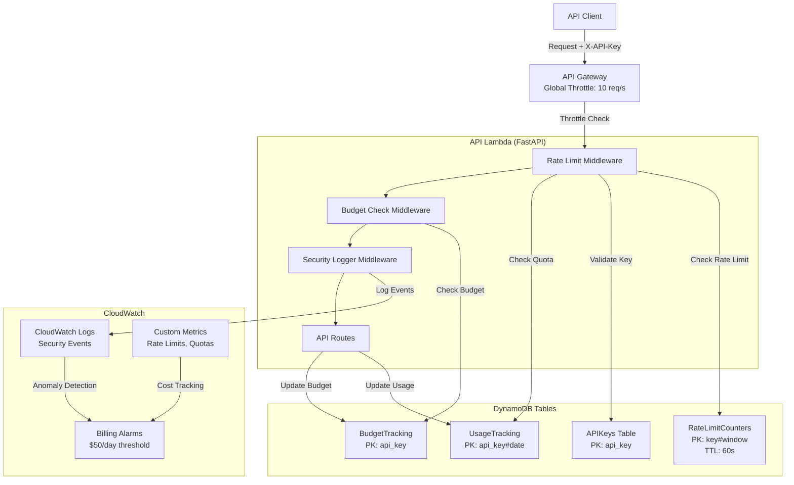
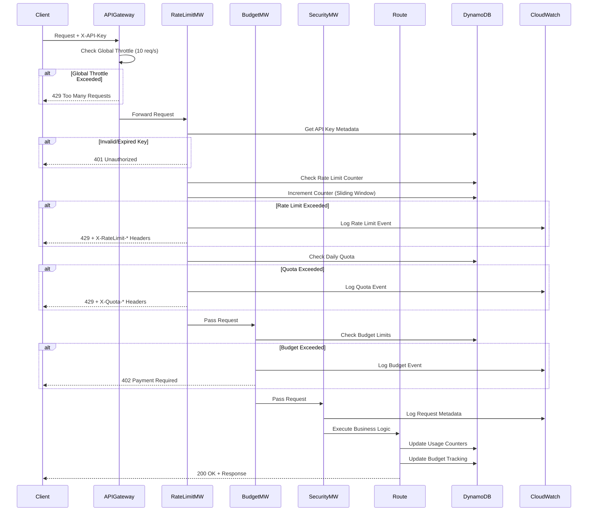

# Design Document: Rate Limiting and API Security

## Overview

This design implements a comprehensive rate limiting and API security system for VibeJudge AI to prevent abuse, control costs, and enable monetization. The system provides multi-tier rate limiting (global, per-API-key, per-IP), quota management, budget enforcement, and security monitoring. It uses DynamoDB for distributed rate limit counters with sliding window algorithm, FastAPI middleware for enforcement, and CloudWatch for monitoring and alerting.

## Architecture



## Main Algorithm/Workflow




## Components and Interfaces

### Component 1: Rate Limit Middleware

**Purpose**: Enforce per-API-key rate limits using sliding window algorithm with DynamoDB counters

**Interface**:
```python
class RateLimitMiddleware:
    def __init__(
        self,
        app: ASGIApp,
        db_helper: DynamoDBHelper,
        exempt_paths: list[str] = ["/health", "/docs"]
    ) -> None: ...

    async def __call__(
        self,
        scope: Scope,
        receive: Receive,
        send: Send
    ) -> None: ...

    async def check_rate_limit(
        self,
        api_key: str,
        window_start: int
    ) -> tuple[bool, int, int]: ...
```

**Responsibilities**:
- Extract API key from X-API-Key header
- Validate API key exists and is active
- Check rate limit using sliding window counter
- Increment counter atomically in DynamoDB
- Return 429 with RFC 6585 headers if exceeded
- Exempt health check and docs endpoints

### Component 2: Budget Enforcement Middleware

**Purpose**: Prevent cost overruns by enforcing budget limits at submission, hackathon, and API key levels

**Interface**:
```python
class BudgetMiddleware:
    def __init__(
        self,
        app: ASGIApp,
        db_helper: DynamoDBHelper,
        max_cost_per_submission: float = 0.50
    ) -> None: ...

    async def __call__(
        self,
        scope: Scope,
        receive: Receive,
        send: Send
    ) -> None: ...

    async def check_budget_limits(
        self,
        api_key: str,
        hackathon_id: str,
        estimated_cost: float
    ) -> tuple[bool, str | None]: ...
```

**Responsibilities**:
- Estimate cost for analysis requests
- Check per-submission budget cap ($0.50)
- Check per-hackathon budget limit
- Check per-API-key cumulative budget
- Return 402 Payment Required if exceeded
- Send alerts at 50%, 80%, 90%, 100% thresholds

### Component 3: Security Logger Middleware

**Purpose**: Log security events and detect anomalous patterns for incident response

**Interface**:
```python
class SecurityLoggerMiddleware:
    def __init__(
        self,
        app: ASGIApp,
        logger: structlog.BoundLogger
    ) -> None: ...

    async def __call__(
        self,
        scope: Scope,
        receive: Receive,
        send: Send
    ) -> None: ...

    async def log_security_event(
        self,
        event_type: str,
        api_key_prefix: str,
        details: dict[str, Any]
    ) -> None: ...

    async def detect_anomalies(
        self,
        api_key: str,
        request_count: int,
        time_window: int
    ) -> bool: ...
```

**Responsibilities**:
- Log all authentication failures (401/403)
- Log rate limit violations (429)
- Log budget exceeded events (402)
- Detect unusual patterns (>100 req/min)
- Mask sensitive data (full API keys)
- Trigger CloudWatch alarms for anomalies

### Component 4: API Key Service

**Purpose**: Manage API key lifecycle including creation, validation, rotation, and revocation

**Interface**:
```python
class APIKeyService:
    def __init__(self, db_helper: DynamoDBHelper) -> None: ...

    def create_api_key(
        self,
        organizer_id: str,
        hackathon_id: str | None,
        tier: Tier,
        expires_at: datetime | None,
        rate_limit: int,
        daily_quota: int,
        budget_limit_usd: float
    ) -> APIKey: ...

    def validate_api_key(
        self,
        api_key: str
    ) -> APIKey | None: ...

    def rotate_api_key(
        self,
        api_key_id: str
    ) -> tuple[APIKey, APIKey]: ...

    def revoke_api_key(
        self,
        api_key_id: str
    ) -> bool: ...

    def list_api_keys(
        self,
        organizer_id: str
    ) -> list[APIKey]: ...
```

**Responsibilities**:
- Generate secure API keys with format: vj_{env}_{32-char-base64}
- Store API key metadata in DynamoDB
- Validate key expiration and active status
- Handle key rotation with 7-day grace period
- Soft delete keys (set active=false)
- Track key usage statistics

### Component 5: Usage Tracking Service

**Purpose**: Track API usage, quotas, and generate analytics for reporting and billing

**Interface**:
```python
class UsageTrackingService:
    def __init__(self, db_helper: DynamoDBHelper) -> None: ...

    def record_request(
        self,
        api_key: str,
        endpoint: str,
        status_code: int,
        response_time_ms: float,
        cost_usd: float
    ) -> None: ...

    def check_daily_quota(
        self,
        api_key: str,
        date: str
    ) -> tuple[int, int]: ...

    def get_usage_summary(
        self,
        organizer_id: str,
        start_date: datetime,
        end_date: datetime
    ) -> UsageSummary: ...

    def export_usage_csv(
        self,
        organizer_id: str,
        start_date: datetime,
        end_date: datetime
    ) -> str: ...
```

**Responsibilities**:
- Record every API request with metadata
- Track daily quota consumption
- Reset quotas at midnight UTC
- Generate usage summaries and reports
- Export usage data to CSV
- Calculate cost attribution by hackathon/key

### Component 6: Cost Estimation Service

**Purpose**: Estimate analysis costs before execution to prevent budget surprises

**Interface**:
```python
class CostEstimationService:
    def __init__(
        self,
        db_helper: DynamoDBHelper,
        model_rates: dict[str, dict[str, float]]
    ) -> None: ...

    def estimate_submission_cost(
        self,
        repo_url: str,
        agent_config: dict[str, bool]
    ) -> CostEstimate: ...

    def estimate_hackathon_cost(
        self,
        hackathon_id: str
    ) -> CostEstimate: ...

    def check_budget_availability(
        self,
        api_key: str,
        estimated_cost: float
    ) -> tuple[bool, float]: ...
```

**Responsibilities**:
- Estimate cost based on repo size and enabled agents
- Use historical averages for similar repos
- Factor in large repo premium (>100 files = $0.10)
- Compare estimate against remaining budget
- Return warnings if estimate exceeds 80% of budget
- Provide cost breakdown by agent


## Data Models

### Model 1: APIKey

```python
class APIKey(VibeJudgeBase):
    """API key with scoping, rate limits, and budget controls."""

    api_key_id: str = Field(description="ULID identifier")
    api_key: str = Field(description="Secret key: vj_{env}_{32-char-base64}")
    organizer_id: str = Field(description="Owner organizer ID")
    hackathon_id: str | None = Field(default=None, description="Scoped to hackathon")

    # Tier and limits
    tier: Tier = Field(default=Tier.FREE)
    rate_limit_per_second: int = Field(description="Requests per second")
    daily_quota: int = Field(description="Requests per day")
    budget_limit_usd: float = Field(description="Maximum spend in USD")

    # Status
    active: bool = Field(default=True)
    created_at: datetime = Field(default_factory=datetime.utcnow)
    expires_at: datetime | None = Field(default=None)
    deprecated: bool = Field(default=False)
    deprecated_at: datetime | None = Field(default=None)

    # Usage tracking
    total_requests: int = Field(default=0)
    total_cost_usd: float = Field(default=0.0)
    last_used_at: datetime | None = Field(default=None)
```

**Validation Rules**:
- api_key must match format: `^vj_(live|test)_[A-Za-z0-9+/]{32}$`
- rate_limit_per_second must be > 0
- daily_quota must be > 0
- budget_limit_usd must be >= 0
- expires_at must be in future if set
- hackathon_id must exist in database if set

**DynamoDB Schema**:
```
PK: APIKEY#{api_key_id}
SK: METADATA
GSI1PK: ORG#{organizer_id}
GSI1SK: APIKEY#{created_at}
GSI2PK: HACKATHON#{hackathon_id}
GSI2SK: APIKEY#{api_key_id}
```

### Model 2: RateLimitCounter

```python
class RateLimitCounter(VibeJudgeBase):
    """Sliding window counter for rate limiting."""

    counter_key: str = Field(description="api_key#{window_start_epoch}")
    api_key: str = Field(description="API key being tracked")
    window_start: int = Field(description="Unix timestamp (second precision)")
    request_count: int = Field(default=0)
    ttl: int = Field(description="Auto-delete after 60 seconds")
```

**Validation Rules**:
- window_start must be valid Unix timestamp
- request_count must be >= 0
- ttl must be window_start + 60

**DynamoDB Schema**:
```
PK: RATELIMIT#{api_key}#{window_start}
SK: COUNTER
TTL: ttl (auto-cleanup)
```

### Model 3: UsageRecord

```python
class UsageRecord(VibeJudgeBase):
    """Daily usage tracking for quota management."""

    usage_id: str = Field(description="ULID identifier")
    api_key: str = Field(description="API key")
    date: str = Field(description="YYYY-MM-DD format")

    # Counters
    request_count: int = Field(default=0)
    successful_requests: int = Field(default=0)
    failed_requests: int = Field(default=0)

    # Cost tracking
    total_cost_usd: float = Field(default=0.0)
    bedrock_cost_usd: float = Field(default=0.0)
    lambda_cost_usd: float = Field(default=0.0)

    # Metadata
    endpoints_used: dict[str, int] = Field(default_factory=dict)
    last_updated: datetime = Field(default_factory=datetime.utcnow)
```

**Validation Rules**:
- date must be valid YYYY-MM-DD format
- All cost fields must be >= 0
- request_count = successful_requests + failed_requests

**DynamoDB Schema**:
```
PK: USAGE#{api_key}#{date}
SK: SUMMARY
GSI1PK: APIKEY#{api_key}
GSI1SK: DATE#{date}
```

### Model 4: BudgetTracking

```python
class BudgetTracking(VibeJudgeBase):
    """Real-time budget tracking for cost control."""

    entity_type: str = Field(description="api_key | hackathon | submission")
    entity_id: str = Field(description="Entity identifier")

    # Budget limits
    budget_limit_usd: float = Field(description="Maximum allowed spend")
    current_spend_usd: float = Field(default=0.0)

    # Alerts
    alert_50_sent: bool = Field(default=False)
    alert_80_sent: bool = Field(default=False)
    alert_90_sent: bool = Field(default=False)
    alert_100_sent: bool = Field(default=False)

    # Metadata
    last_updated: datetime = Field(default_factory=datetime.utcnow)
```

**Validation Rules**:
- entity_type must be one of: api_key, hackathon, submission
- budget_limit_usd must be > 0
- current_spend_usd must be >= 0
- current_spend_usd should not exceed budget_limit_usd * 1.1 (10% grace)

**DynamoDB Schema**:
```
PK: BUDGET#{entity_type}#{entity_id}
SK: TRACKING
GSI1PK: ENTITY#{entity_type}
GSI1SK: SPEND#{current_spend_usd}
```

### Model 5: SecurityEvent

```python
class SecurityEvent(VibeJudgeBase):
    """Security event log for monitoring and incident response."""

    event_id: str = Field(description="ULID identifier")
    event_type: str = Field(description="auth_failure | rate_limit | budget_exceeded | anomaly")
    timestamp: datetime = Field(default_factory=datetime.utcnow)

    # Request context
    api_key_prefix: str = Field(description="First 8 chars of API key")
    ip_address: str | None = Field(default=None)
    endpoint: str = Field(description="API endpoint")

    # Event details
    status_code: int = Field(description="HTTP status code")
    error_message: str | None = Field(default=None)
    metadata: dict[str, Any] = Field(default_factory=dict)

    # Severity
    severity: Severity = Field(default=Severity.INFO)
```

**Validation Rules**:
- event_type must be one of: auth_failure, rate_limit, budget_exceeded, anomaly
- api_key_prefix must be exactly 8 characters
- status_code must be valid HTTP status (400-599)
- ip_address must be valid IPv4 or IPv6 if set

**DynamoDB Schema**:
```
PK: SECURITY#{date}
SK: EVENT#{timestamp}#{event_id}
GSI1PK: APIKEY#{api_key_prefix}
GSI1SK: TIMESTAMP#{timestamp}
TTL: timestamp + 30 days (auto-cleanup)
```


## Key Functions with Formal Specifications

### Function 1: check_rate_limit()

```python
async def check_rate_limit(
    api_key: str,
    current_time: int,
    rate_limit: int,
    db_helper: DynamoDBHelper
) -> tuple[bool, int, int]
```

**Preconditions:**
- `api_key` is non-empty string
- `current_time` is valid Unix timestamp (seconds)
- `rate_limit` is positive integer > 0
- `db_helper` is initialized DynamoDB connection

**Postconditions:**
- Returns tuple: (allowed: bool, remaining: int, reset_time: int)
- If `allowed == True`: request count < rate_limit
- If `allowed == False`: request count >= rate_limit
- `remaining` = max(0, rate_limit - current_count)
- `reset_time` = window_start + 1 (next second)
- Counter incremented atomically in DynamoDB if allowed
- TTL set to window_start + 60 for auto-cleanup

**Loop Invariants:** N/A (no loops)

### Function 2: check_daily_quota()

```python
async def check_daily_quota(
    api_key: str,
    date: str,
    daily_quota: int,
    db_helper: DynamoDBHelper
) -> tuple[bool, int, int]
```

**Preconditions:**
- `api_key` is non-empty string
- `date` is valid YYYY-MM-DD format
- `daily_quota` is positive integer > 0
- `db_helper` is initialized DynamoDB connection

**Postconditions:**
- Returns tuple: (allowed: bool, used: int, remaining: int)
- If `allowed == True`: used < daily_quota
- If `allowed == False`: used >= daily_quota
- `remaining` = max(0, daily_quota - used)
- Usage counter incremented if allowed
- Quota resets automatically at midnight UTC

**Loop Invariants:** N/A (no loops)

### Function 3: check_budget_limit()

```python
async def check_budget_limit(
    entity_type: str,
    entity_id: str,
    estimated_cost: float,
    db_helper: DynamoDBHelper
) -> tuple[bool, float, str | None]
```

**Preconditions:**
- `entity_type` in ["api_key", "hackathon", "submission"]
- `entity_id` is non-empty string
- `estimated_cost` >= 0.0
- `db_helper` is initialized DynamoDB connection

**Postconditions:**
- Returns tuple: (allowed: bool, remaining: float, warning: str | None)
- If `allowed == True`: current_spend + estimated_cost <= budget_limit
- If `allowed == False`: current_spend + estimated_cost > budget_limit
- `remaining` = max(0.0, budget_limit - current_spend)
- `warning` set if remaining < estimated_cost * 1.2 (20% buffer)
- No side effects on budget tracking (read-only check)

**Loop Invariants:** N/A (no loops)

### Function 4: generate_api_key()

```python
def generate_api_key(
    environment: str,
    key_length: int = 32
) -> str
```

**Preconditions:**
- `environment` in ["live", "test"]
- `key_length` is positive integer (typically 32)

**Postconditions:**
- Returns string matching format: `vj_{environment}_{base64_string}`
- `base64_string` is URL-safe base64 encoding of random bytes
- Length of `base64_string` = key_length characters
- Key is cryptographically secure (uses secrets module)
- Key is unique (collision probability < 1 in 2^256)

**Loop Invariants:** N/A (no loops)

### Function 5: validate_api_key_format()

```python
def validate_api_key_format(
    api_key: str
) -> bool
```

**Preconditions:**
- `api_key` is string (may be empty or invalid)

**Postconditions:**
- Returns `True` if and only if api_key matches regex: `^vj_(live|test)_[A-Za-z0-9+/]{32}$`
- Returns `False` for any malformed key
- No side effects (pure function)

**Loop Invariants:** N/A (no loops)

### Function 6: increment_counter_atomic()

```python
async def increment_counter_atomic(
    counter_key: str,
    ttl: int,
    db_helper: DynamoDBHelper
) -> int
```

**Preconditions:**
- `counter_key` is non-empty string
- `ttl` is valid Unix timestamp in future
- `db_helper` is initialized DynamoDB connection

**Postconditions:**
- Returns new counter value after increment
- Counter incremented by 1 atomically (no race conditions)
- If counter doesn't exist, creates with value 1
- TTL attribute set for auto-deletion
- Operation is idempotent-safe with conditional expressions

**Loop Invariants:** N/A (no loops)


## Algorithmic Pseudocode

### Main Rate Limiting Algorithm (Sliding Window)

```python
ALGORITHM check_and_enforce_rate_limit(request)
INPUT: request with api_key and timestamp
OUTPUT: response (200 OK or 429 Too Many Requests)

BEGIN
  # Step 1: Validate API key
  api_key_data ← db.get_api_key(request.api_key)

  IF api_key_data is None OR NOT api_key_data.active THEN
    RETURN 401 Unauthorized
  END IF

  # Step 2: Check rate limit (sliding window)
  window_start ← floor(request.timestamp)
  counter_key ← f"{request.api_key}#{window_start}"
  current_count ← db.get_counter(counter_key) OR 0

  IF current_count >= api_key_data.rate_limit_per_second THEN
    RETURN 429 Too Many Requests WITH headers
  END IF

  # Step 3: Increment counter atomically
  new_count ← db.increment_atomic(key=counter_key, ttl=window_start + 60)
  remaining ← api_key_data.rate_limit_per_second - new_count

  RETURN CONTINUE with rate_limit_headers
END
```

### Budget Enforcement Algorithm

```python
ALGORITHM enforce_budget_limits(api_key, hackathon_id, estimated_cost)
INPUT: api_key, hackathon_id, estimated_cost in USD
OUTPUT: (allowed: bool, error_message: str | None)

BEGIN
  # Step 1: Check per-submission cap
  IF estimated_cost > MAX_COST_PER_SUBMISSION THEN
    RETURN (False, "Per-submission limit exceeded")
  END IF

  # Step 2: Check API key budget
  api_key_budget ← db.get_budget_tracking("api_key", api_key)
  IF api_key_budget.current_spend + estimated_cost > api_key_budget.budget_limit THEN
    RETURN (False, "API key budget exceeded")
  END IF

  # Step 3: Check hackathon budget
  IF hackathon_id is not None THEN
    hackathon_budget ← db.get_budget_tracking("hackathon", hackathon_id)
    IF hackathon_budget.current_spend + estimated_cost > hackathon_budget.budget_limit THEN
      RETURN (False, "Hackathon budget exceeded")
    END IF
  END IF

  RETURN (True, None)
END
```

### API Key Generation Algorithm

```python
ALGORITHM generate_secure_api_key(environment, organizer_id, tier)
INPUT: environment ("live" or "test"), organizer_id, tier
OUTPUT: APIKey object with secure key

BEGIN
  # Step 1: Generate cryptographically secure key
  random_bytes ← secrets.token_bytes(24)
  base64_key ← base64.urlsafe_b64encode(random_bytes).decode()
  api_key_string ← f"vj_{environment}_{base64_key}"

  # Step 2: Set tier-based limits
  rate_limit, daily_quota, budget_limit ← get_tier_limits(tier)

  # Step 3: Create and store API key
  api_key_obj ← APIKey(
    api_key_id=generate_ulid(),
    api_key=api_key_string,
    organizer_id=organizer_id,
    tier=tier,
    rate_limit_per_second=rate_limit,
    daily_quota=daily_quota,
    budget_limit_usd=budget_limit,
    active=True
  )

  db.put_item(api_key_obj)

  RETURN api_key_obj
END
```

## Example Usage

### Example 1: Rate Limit Check in Middleware

```python
# FastAPI middleware implementation
from fastapi import Request, Response
from starlette.middleware.base import BaseHTTPMiddleware
import time

class RateLimitMiddleware(BaseHTTPMiddleware):
    async def dispatch(self, request: Request, call_next):
        # Extract API key
        api_key = request.headers.get("X-API-Key")
        if not api_key:
            return Response(status_code=401, content="Missing API key")

        # Check rate limit
        current_time = int(time.time())
        allowed, remaining, reset_time = await check_rate_limit(
            api_key=api_key,
            current_time=current_time,
            rate_limit=10,  # From API key metadata
            db_helper=self.db
        )

        if not allowed:
            return Response(
                status_code=429,
                headers={
                    "X-RateLimit-Limit": "10",
                    "X-RateLimit-Remaining": "0",
                    "X-RateLimit-Reset": str(reset_time),
                    "Retry-After": str(reset_time - current_time)
                },
                content="Rate limit exceeded"
            )

        # Process request
        response = await call_next(request)

        # Add rate limit headers
        response.headers["X-RateLimit-Limit"] = "10"
        response.headers["X-RateLimit-Remaining"] = str(remaining)
        response.headers["X-RateLimit-Reset"] = str(reset_time)

        return response
```

### Example 2: Budget Check Before Analysis

```python
# In analysis route handler
@router.post("/hackathons/{hackathon_id}/analyze")
async def trigger_analysis(
    hackathon_id: str,
    api_key: str = Depends(verify_api_key),
    cost_service: CostEstimationService = Depends(get_cost_service)
):
    # Estimate cost
    estimate = await cost_service.estimate_hackathon_cost(hackathon_id)

    # Check budget limits
    allowed, error_msg = await enforce_budget_limits(
        api_key=api_key,
        hackathon_id=hackathon_id,
        estimated_cost=estimate.total_cost_usd
    )

    if not allowed:
        return Response(
            status_code=402,
            content={"error": error_msg, "estimated_cost": estimate.total_cost_usd}
        )

    # Proceed with analysis
    job_id = await analysis_service.start_analysis(hackathon_id)
    return {"job_id": job_id, "estimated_cost": estimate.total_cost_usd}
```

### Example 3: API Key Creation

```python
# In API key management route
@router.post("/api-keys")
async def create_api_key(
    request: APIKeyCreateRequest,
    organizer_id: str = Depends(get_current_organizer),
    api_key_service: APIKeyService = Depends(get_api_key_service)
):
    # Generate new API key
    api_key = api_key_service.create_api_key(
        organizer_id=organizer_id,
        hackathon_id=request.hackathon_id,
        tier=request.tier,
        expires_at=request.expires_at,
        rate_limit=request.rate_limit or get_default_rate_limit(request.tier),
        daily_quota=request.daily_quota or get_default_quota(request.tier),
        budget_limit_usd=request.budget_limit_usd or get_default_budget(request.tier)
    )

    # Return key (only shown once)
    return {
        "api_key_id": api_key.api_key_id,
        "api_key": api_key.api_key,  # Only returned on creation
        "tier": api_key.tier,
        "rate_limit": api_key.rate_limit_per_second,
        "daily_quota": api_key.daily_quota,
        "budget_limit_usd": api_key.budget_limit_usd,
        "created_at": api_key.created_at.isoformat()
    }
```

### Example 4: Security Event Logging

```python
# In security logger middleware
async def log_security_event(
    event_type: str,
    api_key_prefix: str,
    endpoint: str,
    status_code: int,
    details: dict
):
    event = SecurityEvent(
        event_id=generate_ulid(),
        event_type=event_type,
        timestamp=datetime.utcnow(),
        api_key_prefix=api_key_prefix,
        endpoint=endpoint,
        status_code=status_code,
        metadata=details,
        severity=get_severity(event_type, status_code)
    )

    # Log to CloudWatch
    logger.warning(
        "security_event",
        event_type=event_type,
        api_key_prefix=api_key_prefix,
        endpoint=endpoint,
        status_code=status_code,
        **details
    )

    # Store in DynamoDB for analytics
    await db.put_item(event)

    # Trigger alarm if critical
    if event.severity == Severity.CRITICAL:
        await cloudwatch.put_metric_data(
            Namespace="VibeJudge/Security",
            MetricName="CriticalSecurityEvents",
            Value=1.0
        )
```


## Correctness Properties

### Property 1: Rate Limit Enforcement
∀ api_key, time_window: count(requests(api_key, time_window)) ≤ rate_limit(api_key)

### Property 2: Budget Non-Violation
∀ entity: current_spend(entity) + estimated_cost > budget_limit(entity) ⟹ request_rejected(entity)

### Property 3: API Key Uniqueness
∀ key1, key2 ∈ generated_keys: key1 ≠ key2 ∧ format_valid(key1) ∧ format_valid(key2)

### Property 4: Quota Reset Consistency
∀ api_key, date: usage(api_key, date) < daily_quota(api_key) ∧ date_changed(date, date + 1) ⟹ usage(api_key, date + 1) = 0

### Property 5: Security Event Logging
∀ request: status_code(request) ∈ {401, 403, 429, 402} ⟹ ∃ security_event ∈ logs

### Property 6: Atomic Counter Increment
∀ counter_key, concurrent_requests: final_count(counter_key) = initial_count(counter_key) + len(concurrent_requests)

## Error Handling

### Error Scenario 1: Invalid API Key
- **Condition:** API key not found or format invalid
- **Response:** 401 Unauthorized
- **Recovery:** Client provides valid API key
- **Logging:** Authentication failure with key prefix

### Error Scenario 2: Expired API Key
- **Condition:** expires_at < current_time
- **Response:** 401 Unauthorized "API key expired"
- **Recovery:** Client rotates to new key
- **Logging:** Expiration event, email notification

### Error Scenario 3: Rate Limit Exceeded
- **Condition:** Request count >= rate_limit_per_second
- **Response:** 429 Too Many Requests with Retry-After
- **Recovery:** Client waits until reset_time
- **Logging:** Rate limit violation, CloudWatch metric

### Error Scenario 4: Daily Quota Exceeded
- **Condition:** Daily requests >= daily_quota
- **Response:** 429 with quota reset time
- **Recovery:** Wait until midnight UTC
- **Logging:** Quota exceeded, 90% threshold alert

### Error Scenario 5: Budget Limit Exceeded
- **Condition:** current_spend + estimated_cost > budget_limit
- **Response:** 402 Payment Required
- **Recovery:** Increase budget or wait for cycle
- **Logging:** Budget exceeded, immediate alert

### Error Scenario 6: DynamoDB Throttling
- **Condition:** ProvisionedThroughputExceededException
- **Response:** 503 Service Unavailable
- **Recovery:** Exponential backoff retry (3 attempts)
- **Logging:** Throttling event, sustained alert

## Testing Strategy

### Unit Testing Approach
- **Coverage Goal:** 90%+ for services and middleware
- **Key Tests:** Rate limit counter, budget calculation, API key generation, quota reset
- **Mocking:** DynamoDB (moto), CloudWatch, time.time()
- **Framework:** pytest with fixtures

### Property-Based Testing Approach
- **Library:** fast-check (pytest-quickcheck)
- **Properties:** Rate limit enforcement, budget limits, API key format, quota resets, atomic counters
- **Strategy:** 1000+ iterations, random request sequences, concurrent scenarios

### Integration Testing Approach
- **Environment:** LocalStack for AWS services
- **Scenarios:** End-to-end rate limiting, budget enforcement, API key lifecycle, quota reset, security logging
- **Test Data:** Sample API keys per tier, mock hackathons, simulated costs

## Performance Considerations

- **Rate Limit Check Latency:** < 5ms target
- **DynamoDB Operations:** GetItem (1-2ms), atomic increment (2-3ms)
- **Caching:** API key metadata cached in Lambda (10min TTL)
- **Capacity Planning:** 5 WCU/RCU free tier sufficient for MVP
- **Optimization:** Batch writes for usage tracking, TTL for auto-cleanup
- **Scalability:** Horizontal scaling with DynamoDB, no single point of failure

## Security Considerations

- **API Key Security:** 256-bit entropy, secrets.token_bytes, HTTPS required
- **Logging:** Only first 8 chars logged, no full keys
- **Threat Mitigation:** Rate limiting on auth failures, key rotation, multi-level budgets
- **Compliance:** GDPR (pseudonymous IDs), SOC 2 (30-day audit logs)

## Dependencies

**New DynamoDB Tables:**
- APIKeys, RateLimitCounters (TTL), UsageTracking, BudgetTracking, SecurityEvents (TTL 30d)

**CloudWatch Resources:**
- Log group: /aws/lambda/vibejudge-api
- Billing alarm: $50/day threshold
- Custom metrics: RateLimitViolations, BudgetExceeded, AuthFailures

**Lambda Environment Variables:**
- MAX_COST_PER_SUBMISSION=0.50
- RATE_LIMIT_CACHE_TTL=600
- SECURITY_LOG_RETENTION_DAYS=30

**Integration Points:**
- Extend existing authentication
- Add budget enforcement to cost tracking
- Add middleware to FastAPI routes
- Add API key management to Streamlit dashboard
