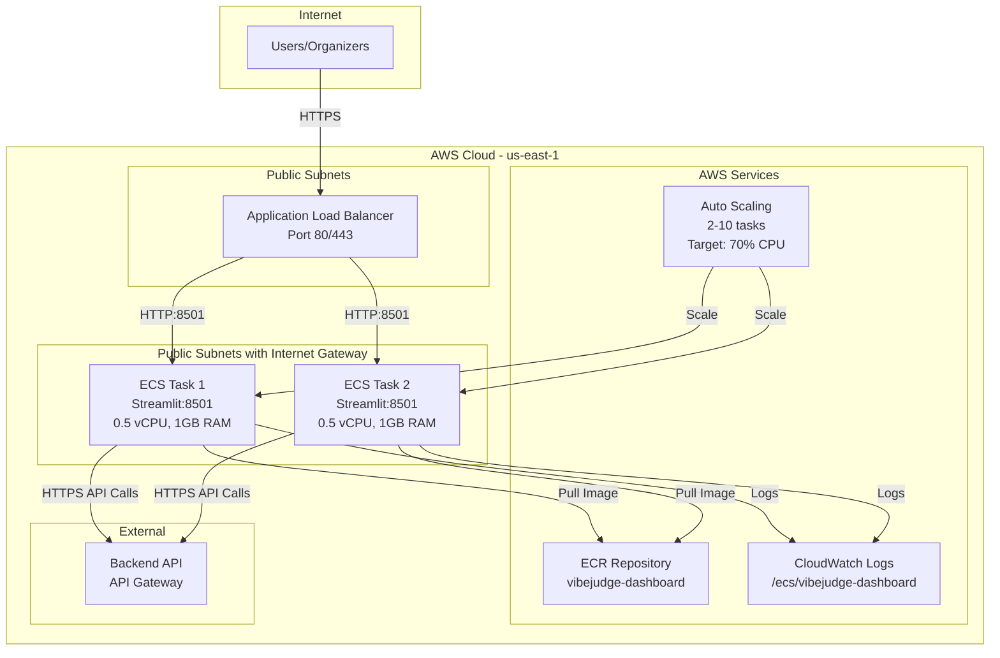

# Design Document: Streamlit Dashboard AWS ECS Deployment

## Overview

This design document specifies the production deployment architecture for the VibeJudge AI Streamlit Organizer Dashboard on AWS ECS Fargate.


The solution provides a highly available, auto-scaling, containerized deployment with Application Load Balancer, CloudWatch monitoring, and Infrastructure as Code using AWS SAM. The architecture targets <$60/month operational cost while supporting 100 concurrent users with 99.9% uptime and <2s page load times.

The deployment consists of: (1) Docker containerization of the existing Streamlit application, (2) ECR repository for image storage, (3) ECS Fargate cluster with auto-scaling service, (4) Application Load Balancer for HTTPS traffic distribution, (5) CloudWatch for logging and monitoring, and (6) SAM templates for infrastructure provisioning.

## Architecture

### System Component Diagram




**Responsibilities**:
- Run Streamlit application on port 8501
- Respond to health checks at `/_stcore/health`
- Accept API_BASE_URL as environment variable
- Run as non-root user (streamlit:streamlit, UID 1000)
- Optimize image size (<500MB) using multi-stage builds

### Component 2: ECR Repository

**Purpose**: Store and version Docker images with lifecycle management and vulnerability scanning.

**Interface**:
```python
# Repository Configuration
repository_name = "vibejudge-dashboard"
image_tag_mutability = "MUTABLE"  # Allow "latest" tag updates
scan_on_push = True  # Automatic vulnerability scanning

# Lifecycle Policy
lifecycle_policy = {
    "rules": [{
        "rulePriority": 1,
        "description": "Keep only 10 most recent images",
        "selection": {
            "tagStatus": "any",
            "countType": "imageCountMoreThan",
            "countNumber": 10
        },
        "action": {"type": "expire"}
    }]
}
```

**Responsibilities**:
- Store Docker images with SHA256 digests
- Tag images with Git commit SHA and "latest"
- Scan images for CVE vulnerabilities
- Automatically delete images older than 10 most recent
- Provide IAM-based access control for ECS task execution role

### Component 3: ECS Fargate Cluster

**Purpose**: Serverless container orchestration platform for running Streamlit tasks.

**Interface**:
```yaml
ClusterName: vibejudge-cluster
CapacityProviders:
  - FARGATE
  - FARGATE_SPOT  # 70% cost savings when available
DefaultCapacityProviderStrategy:
  - CapacityProvider: FARGATE_SPOT
    Weight: 1
    Base: 0
  - CapacityProvider: FARGATE
    Weight: 1
    Base: 2  # Always run 2 tasks on FARGATE for reliability
ContainerInsights: enabled
```

**Responsibilities**:
- Manage ECS task lifecycle (start, stop, restart)
- Distribute tasks across availability zones
- Integrate with CloudWatch Container Insights
- Support both FARGATE and FARGATE_SPOT capacity providers


### Component 6: ECS Service

**Purpose**: Maintain desired number of running tasks with auto-healing and rolling deployments.

**Interface**:
```yaml
ServiceName: vibejudge-dashboard-service
Cluster: !Ref ECSCluster
TaskDefinition: !Ref TaskDefinition
DesiredCount: 2
LaunchType: FARGATE

NetworkConfiguration:
  AwsvpcConfiguration:
    AssignPublicIp: ENABLED  # No NAT Gateway
    Subnets: [PublicSubnet1, PublicSubnet2]
    SecurityGroups: [ECSSecurityGroup]

LoadBalancers:
  - TargetGroupArn: !Ref TargetGroup
    ContainerName: streamlit-dashboard
    ContainerPort: 8501

DeploymentConfiguration:
  MaximumPercent: 200  # Can run 4 tasks during deployment
  MinimumHealthyPercent: 100  # Always keep 2 healthy tasks
  DeploymentCircuitBreaker:
    Enable: true
    Rollback: true

HealthCheckGracePeriodSeconds: 60
```

**Responsibilities**:
- Maintain 2 running tasks at all times
- Replace failed tasks automatically
- Perform rolling deployments (blue/green)
- Register tasks with ALB target group
- Rollback failed deployments automatically

### Component 7: Auto Scaling

**Purpose**: Dynamically adjust task count based on CPU utilization.

**Interface**:
```yaml
ScalableTarget:
  ServiceNamespace: ecs
  ResourceId: service/vibejudge-cluster/vibejudge-dashboard-service
  ScalableDimension: ecs:service:DesiredCount
  MinCapacity: 2
  MaxCapacity: 10

ScalingPolicy:
  PolicyType: TargetTrackingScaling
  TargetTrackingScalingPolicyConfiguration:
    TargetValue: 70.0  # Target 70% CPU utilization
    PredefinedMetricSpecification:
      PredefinedMetricType: ECSServiceAverageCPUUtilization
    ScaleOutCooldown: 60  # Wait 60s before scaling out again
    ScaleInCooldown: 300  # Wait 5min before scaling in again
```

**Responsibilities**:
- Monitor average CPU utilization across all tasks
- Scale out when CPU > 70% for 60 seconds
- Scale in when CPU < 70% for 300 seconds
- Respect min (2) and max (10) task limits
- Publish scaling activities to CloudWatch


## Data Models

### Dockerfile Structure

```dockerfile
# Multi-stage build for optimization
FROM python:3.12-slim AS builder
FROM python:3.12-slim AS runtime

# Image metadata
LABEL maintainer="vibejudge-team"
LABEL version="1.0"
LABEL description="VibeJudge AI Streamlit Organizer Dashboard"

# Runtime configuration
WORKDIR /app
USER streamlit:streamlit
EXPOSE 8501

# Environment variables (overridable)
ENV API_BASE_URL=""
ENV STREAMLIT_SERVER_PORT=8501
ENV STREAMLIT_SERVER_ADDRESS=0.0.0.0
ENV STREAMLIT_SERVER_HEADLESS=true
ENV STREAMLIT_BROWSER_GATHER_USAGE_STATS=false
```

### SAM Template Structure

```yaml
AWSTemplateFormatVersion: '2010-09-09'
Transform: AWS::Serverless-2016-10-31
Description: VibeJudge AI Streamlit Dashboard - ECS Fargate Deployment

Parameters:
  Environment:
    Type: String
    Default: dev
    AllowedValues: [dev, prod]
  ImageTag:
    Type: String
    Default: latest
  DomainName:
    Type: String
    Default: ""
    Description: "Optional custom domain (requires manual ACM cert)"

Resources:
  # Networking
  - VPC
  - PublicSubnet1
  - PublicSubnet2
  - InternetGateway
  - RouteTable
  
  # Security
  - ALBSecurityGroup
  - ECSSecurityGroup
  
  # Container Registry
  - ECRRepository
  
  # Load Balancing
  - ApplicationLoadBalancer
  - ALBListener80
  - ALBListener443
  - TargetGroup
  
  # ECS
  - ECSCluster
  - TaskDefinition
  - TaskExecutionRole
  - TaskRole
  - ECSService
  
  # Auto Scaling
  - ScalableTarget
  - ScalingPolicy
  
  # Monitoring
  - LogGroup
  - HealthyHostAlarm
  - ResponseTimeAlarm
  - SNSTopic

Outputs:
  LoadBalancerDNS:
    Description: "ALB DNS name for accessing dashboard"
    Value: !GetAtt ApplicationLoadBalancer.DNSName
  ECSClusterArn:
    Description: "ECS Cluster ARN"
    Value: !GetAtt ECSCluster.Arn
  ServiceArn:
    Description: "ECS Service ARN"
    Value: !Ref ECSService
  ECRRepositoryUri:
    Description: "ECR Repository URI"
    Value: !GetAtt ECRRepository.RepositoryUri
```


### Deployment Script Pseudocode

```pascal
ALGORITHM deploy_streamlit_dashboard
INPUT: environment (dev|prod), git_commit_sha
OUTPUT: deployment_status, alb_url

BEGIN
  // Step 1: Validate prerequisites
  ASSERT aws_cli_installed() = true
  ASSERT docker_installed() = true
  ASSERT sam_cli_installed() = true
  ASSERT git_commit_sha IS NOT NULL
  
  // Step 2: Build Docker image
  PRINT "Building Docker image..."
  docker_build_result ← EXECUTE "docker build -t vibejudge-dashboard:${git_commit_sha} -f Dockerfile ."
  IF docker_build_result.exit_code ≠ 0 THEN
    PRINT "Docker build failed"
    RETURN (FAILED, NULL)
  END IF
  
  // Step 3: Tag image
  PRINT "Tagging image..."
  aws_account_id ← EXECUTE "aws sts get-caller-identity --query Account --output text"
  ecr_uri ← "${aws_account_id}.dkr.ecr.us-east-1.amazonaws.com/vibejudge-dashboard"
  
  EXECUTE "docker tag vibejudge-dashboard:${git_commit_sha} ${ecr_uri}:${git_commit_sha}"
  EXECUTE "docker tag vibejudge-dashboard:${git_commit_sha} ${ecr_uri}:latest"
  
  // Step 4: Authenticate with ECR
  PRINT "Authenticating with ECR..."
  ecr_login ← EXECUTE "aws ecr get-login-password --region us-east-1 | docker login --username AWS --password-stdin ${ecr_uri}"
  IF ecr_login.exit_code ≠ 0 THEN
    PRINT "ECR authentication failed"
    RETURN (FAILED, NULL)
  END IF
  
  // Step 5: Push image to ECR
  PRINT "Pushing image to ECR..."
  push_sha ← EXECUTE "docker push ${ecr_uri}:${git_commit_sha}"
  push_latest ← EXECUTE "docker push ${ecr_uri}:latest"
  IF push_sha.exit_code ≠ 0 OR push_latest.exit_code ≠ 0 THEN
    PRINT "Image push failed"
    RETURN (FAILED, NULL)
  END IF
  
  // Step 6: Deploy infrastructure with SAM
  PRINT "Deploying infrastructure..."
  sam_deploy ← EXECUTE "sam deploy --config-env ${environment} --parameter-overrides ImageTag=${git_commit_sha}"
  IF sam_deploy.exit_code ≠ 0 THEN
    PRINT "SAM deployment failed"
    RETURN (FAILED, NULL)
  END IF
  
  // Step 7: Wait for ECS service to stabilize
  PRINT "Waiting for ECS service to stabilize..."
  cluster_name ← "vibejudge-cluster"
  service_name ← "vibejudge-dashboard-service"
  
  wait_result ← EXECUTE "aws ecs wait services-stable --cluster ${cluster_name} --services ${service_name} --region us-east-1"
  IF wait_result.exit_code ≠ 0 THEN
    PRINT "ECS service failed to stabilize"
    RETURN (FAILED, NULL)
  END IF
  
  // Step 8: Get ALB URL
  alb_dns ← EXECUTE "aws cloudformation describe-stacks --stack-name vibejudge-dashboard-${environment} --query 'Stacks[0].Outputs[?OutputKey==`LoadBalancerDNS`].OutputValue' --output text"
  
  PRINT "Deployment successful!"
  PRINT "Dashboard URL: https://${alb_dns}"
  
  RETURN (SUCCESS, alb_dns)
END
```

**Preconditions:**
- AWS CLI configured with valid credentials
- Docker daemon running
- SAM CLI installed (version 1.100+)
- Git repository with valid commit SHA
- ECR repository exists (created by SAM template)

**Postconditions:**
- Docker image pushed to ECR with commit SHA and "latest" tags
- ECS service running with new task definition
- All tasks healthy and registered with ALB
- ALB URL returned for accessing dashboard

**Error Handling:**
- Exit immediately on any command failure
- Rollback ECS deployment automatically via circuit breaker
- Preserve previous task definition for manual rollback


## Error Handling

### Error Scenario 1: Container Fails Health Check

**Condition**: ECS task fails 3 consecutive health checks (90 seconds)

**Response**:
1. ECS marks task as unhealthy
2. ALB stops routing traffic to unhealthy task
3. ECS starts replacement task automatically
4. CloudWatch alarm triggers if HealthyHostCount < 1

**Recovery**:
- Replacement task starts within 60 seconds
- New task passes health check after 60s grace period
- Traffic resumes to new task
- Failed task terminated after deregistration delay (30s)

### Error Scenario 2: Docker Image Pull Failure

**Condition**: ECS cannot pull image from ECR (network issue, missing image, permission denied)

**Response**:
1. Task fails to start with "CannotPullContainerError"
2. ECS retries task placement up to 3 times
3. Deployment circuit breaker detects failure
4. Automatic rollback to previous task definition

**Recovery**:
- Manual investigation of ECR repository and IAM permissions
- Re-push Docker image if missing
- Retry deployment after fixing root cause

### Error Scenario 3: Backend API Unavailable

**Condition**: Streamlit dashboard cannot reach backend API (network issue, API down)

**Response**:
1. Streamlit displays error message to user
2. Retry logic in api_client.py attempts 3 retries with exponential backoff
3. Container remains healthy (health check is independent)
4. User sees "Unable to connect to API" message

**Recovery**:
- Backend API auto-heals (Lambda + API Gateway)
- Streamlit retries succeed once API recovers
- No ECS task restart required

### Error Scenario 4: Out of Memory (OOM)

**Condition**: Streamlit process exceeds 1GB memory limit

**Response**:
1. ECS kills task with "OutOfMemoryError"
2. ECS starts replacement task immediately
3. CloudWatch logs capture OOM event
4. Metrics show MemoryUtilization = 100%

**Recovery**:
- Investigate memory leak in Streamlit code
- Increase task memory to 2GB if legitimate usage
- Optimize data caching in Streamlit app

### Error Scenario 5: Auto-Scaling Limit Reached

**Condition**: CPU > 70% but TaskCount = 10 (max capacity)

**Response**:
1. Auto-scaling stops at max capacity
2. Tasks continue running at high CPU
3. Response time may increase
4. No additional tasks launched

**Recovery**:
- Increase MaxCapacity in SAM template
- Optimize Streamlit code to reduce CPU usage
- Consider vertical scaling (increase vCPU per task)


### Memory Management

**Task Memory**: 1GB RAM

**Streamlit Memory Usage**:
- Base Streamlit process: ~200MB
- Cached API responses: ~100MB (with TTL)
- Plotly charts: ~50MB per chart
- Session state: ~50MB per user
- Total: ~400MB baseline, ~600MB under load

**Monitoring**:
- CloudWatch metric: `MemoryUtilization`
- Alert threshold: > 90% for 5 minutes
- Action: Increase task memory to 2GB if consistently high

## Security Considerations

### Network Security

**Defense in Depth**:
1. **Internet → ALB**: Only ports 80/443 exposed
2. **ALB → ECS**: Security group restricts to port 8501 only
3. **ECS → Internet**: Only port 443 outbound (HTTPS to API)
4. **No SSH Access**: ECS Fargate has no SSH, no bastion host needed

**TLS/SSL**:
- ALB terminates HTTPS with ACM certificate (manual setup required)
- Backend API uses HTTPS (API Gateway enforced)
- No unencrypted traffic between components

### Container Security

**Image Scanning**:
- ECR scans images on push for CVE vulnerabilities
- Block deployment if critical vulnerabilities found
- Regular base image updates (python:3.12-slim)

**Runtime Security**:
- Container runs as non-root user (UID 1000)
- Read-only root filesystem (optional hardening)
- No privileged mode
- No host network mode

**Secrets Management**:
- API_BASE_URL is public (no secret)
- User API keys entered in UI (not stored in container)
- No AWS credentials in container (IAM task role)

### IAM Security

**Task Execution Role** (for ECS to manage container):
```yaml
Policies:
  - AmazonECSTaskExecutionRolePolicy  # ECR pull, CloudWatch logs
  - Statement:
      Effect: Allow
      Action:
        - ecr:GetAuthorizationToken
        - ecr:BatchCheckLayerAvailability
        - ecr:GetDownloadUrlForLayer
        - ecr:BatchGetImage
      Resource: !GetAtt ECRRepository.Arn
```

**Task Role** (for container application):
```yaml
# Streamlit doesn't need AWS access - empty role
Policies: []
```

**Principle of Least Privilege**:
- Task execution role: Only ECR and CloudWatch access
- Task role: No permissions (Streamlit doesn't call AWS APIs)
- ALB: No IAM role (uses security groups only)

### Compliance Considerations

**Data Privacy**:
- No PII stored in Streamlit (stateless)
- API keys transmitted over HTTPS only
- CloudWatch logs retention: 7 days (minimize data exposure)

**Audit Trail**:
- CloudWatch logs capture all container output
- ALB access logs (optional, additional cost)
- CloudTrail captures all AWS API calls


### Scaling Cost Projections

| Scenario | Tasks | Monthly Cost | Notes |
|----------|-------|--------------|-------|
| **Baseline** | 2 | $54.24 | Normal operation |
| **Moderate Load** | 4 | $79.28 | 2x traffic |
| **High Load** | 6 | $104.32 | 3x traffic |
| **Peak Load** | 10 | $154.40 | Max capacity |

**Cost per Additional Task**: ~$12.52/month (with FARGATE_SPOT)

**Auto-Scaling Cost Control**:
- Scale-in cooldown (5 minutes) prevents rapid scaling
- Max capacity limit (10 tasks) caps maximum cost at $154.40/month
- CloudWatch billing alarm recommended at $100/month threshold

## Dependencies

### External Services

1. **Backend API** (existing)
   - URL: https://2nu0j4n648.execute-api.us-east-1.amazonaws.com/dev
   - Authentication: API key (user-provided)
   - Dependency: Streamlit cannot function without API access

2. **AWS Services** (required)
   - ECR: Docker image storage
   - ECS: Container orchestration
   - ALB: Load balancing
   - CloudWatch: Logging and monitoring
   - VPC: Networking infrastructure

3. **ACM Certificate** (manual setup)
   - Required for HTTPS on ALB
   - Must be provisioned in us-east-1
   - Domain validation required

### Development Tools

1. **Docker** (version 20.10+)
   - Build container images
   - Local testing

2. **AWS CLI** (version 2.x)
   - Deploy infrastructure
   - Manage AWS resources

3. **AWS SAM CLI** (version 1.100+)
   - Deploy CloudFormation templates
   - Manage serverless applications

4. **Git** (version 2.x)
   - Version control
   - Generate commit SHAs for image tags

### Streamlit Application

**Location**: `streamlit_ui/` directory

**Dependencies** (from requirements.txt):
- streamlit >= 1.30.0
- requests >= 2.31.0
- plotly >= 5.18.0
- streamlit-autorefresh >= 1.0.0
- python-dateutil >= 2.8.0

**Structure**:
```
streamlit_ui/
├── app.py                    # Main entry point
├── components/
│   ├── api_client.py         # Backend API integration
│   ├── auth.py               # API key management
│   ├── charts.py             # Plotly visualizations
│   ├── formatters.py         # Data formatting
│   └── validators.py         # Input validation
├── pages/
│   ├── 1_🎯_Create_Hackathon.py
│   ├── 2_📊_Live_Dashboard.py
│   ├── 3_🏆_Results.py
│   └── 4_💡_Intelligence.py
└── requirements.txt
```


## Monitoring and Observability

### Key Metrics Dashboard

**ECS Service Metrics**:
- `CPUUtilization`: Target 70%, alert > 90%
- `MemoryUtilization`: Target 60%, alert > 90%
- `DesiredTaskCount`: Baseline 2, max 10
- `RunningTaskCount`: Should equal DesiredTaskCount

**ALB Metrics**:
- `TargetResponseTime`: Target < 2s, alert > 5s
- `RequestCount`: Track traffic patterns
- `HealthyHostCount`: Alert if < 1
- `UnHealthyHostCount`: Alert if > 0
- `HTTPCode_Target_4XX_Count`: Monitor client errors
- `HTTPCode_Target_5XX_Count`: Monitor server errors

**Cost Metrics**:
- Fargate vCPU-Hours: Track scaling costs
- Fargate GB-Hours: Track memory costs
- ALB LCU-Hours: Track load balancer costs

### CloudWatch Logs Insights Queries

**Find Errors**:
```sql
fields @timestamp, @message
| filter @message like /ERROR|Exception|Failed/
| sort @timestamp desc
| limit 100
```

**Track Response Times**:
```sql
fields @timestamp, @message
| filter @message like /response_time/
| stats avg(response_time) as avg_response, max(response_time) as max_response by bin(5m)
```

**Monitor Health Checks**:
```sql
fields @timestamp, @message
| filter @message like /_stcore\/health/
| stats count() by bin(1m)
```

### Alerting Strategy

**Critical Alerts** (immediate action required):
1. No healthy hosts (service down)
2. All tasks failing health checks
3. Deployment rollback triggered

**Warning Alerts** (investigate within 1 hour):
1. High response time (> 5s)
2. High CPU utilization (> 90%)
3. High memory utilization (> 90%)
4. Elevated 5XX error rate (> 1%)

**Info Alerts** (investigate within 24 hours):
1. Auto-scaling triggered
2. Task restarted
3. Cost threshold exceeded

## Operational Runbook

### Common Operations

**View Service Status**:
```bash
aws ecs describe-services \
  --cluster vibejudge-cluster \
  --services vibejudge-dashboard-service \
  --query 'services[0].{Status:status,Running:runningCount,Desired:desiredCount}'
```

**View Task Logs**:
```bash
# Get task ARN
TASK_ARN=$(aws ecs list-tasks --cluster vibejudge-cluster --service-name vibejudge-dashboard-service --query 'taskArns[0]' --output text)

# View logs
aws logs tail /ecs/vibejudge-dashboard --follow
```

**Scale Service Manually**:
```bash
aws ecs update-service \
  --cluster vibejudge-cluster \
  --service vibejudge-dashboard-service \
  --desired-count 4
```

**Restart Service** (force new deployment):
```bash
aws ecs update-service \
  --cluster vibejudge-cluster \
  --service vibejudge-dashboard-service \
  --force-new-deployment
```

**Check ALB Health**:
```bash
aws elbv2 describe-target-health \
  --target-group-arn <target-group-arn>
```


## Correctness Properties

*A property is a characteristic or behavior that should hold true across all valid executions of a system—essentially, a formal statement about what the system should do. Properties serve as the bridge between human-readable specifications and machine-verifiable correctness guarantees.*

### Property 1: Task Count Invariant

*For any* point in time during normal operation, the number of running tasks should be greater than or equal to the minimum capacity (2) and less than or equal to the maximum capacity (10).

**Validates: Requirements 6.1, 7.1**

### Property 2: Health Check Determines Routing

*For any* ECS task, if it fails 3 consecutive health checks, then the ALB should not route any new requests to that task.

**Validates: Requirements 5.5, 6.2**

### Property 3: Auto-Healing Replacement

*For any* failed task, the ECS service should start a replacement task within 60 seconds to maintain the desired count.

**Validates: Requirements 6.2**

### Property 4: Rolling Deployment Safety

*For any* deployment, the number of healthy tasks should never fall below the minimum healthy percent (100% of desired count = 2 tasks) during the deployment process.

**Validates: Requirements 6.3, 6.4**

### Property 5: Deployment Rollback on Failure

*For any* deployment where tasks fail to reach healthy status, the circuit breaker should automatically rollback to the previous task definition.

**Validates: Requirements 6.5**

### Property 6: Scaling Respects Bounds

*For any* scaling action, the resulting task count should never be less than 2 or greater than 10, regardless of CPU utilization.

**Validates: Requirements 7.1, 7.7**

### Property 7: Scaling Cooldown Prevention

*For any* scale-out action, no additional scale-out should occur within 60 seconds, and for any scale-in action, no additional scale-in should occur within 300 seconds.

**Validates: Requirements 7.4, 7.5**

### Property 8: Network Isolation

*For any* inbound traffic to ECS tasks, it should only be accepted on port 8501 and only from the ALB security group, not from the public internet.

**Validates: Requirements 8.2**

### Property 9: Image Lifecycle Enforcement

*For any* ECR repository state, the number of stored images should never exceed 10.

**Validates: Requirements 2.2**

### Property 10: Log Retention Enforcement

*For any* CloudWatch log group, logs older than 7 days should be automatically deleted.

**Validates: Requirements 9.2**

### Property 11: Cost Ceiling

*For any* month of operation, when the task count is at maximum capacity (10 tasks), the total infrastructure cost should not exceed $155.

**Validates: Requirements 12.5**

### Property 12: High Availability Guarantee

*For any* single task failure, at least one healthy task should remain running and serving traffic at all times.

**Validates: Requirements 6.1, 6.2**

### Property 13: Health Check Response Time

*For any* health check request to a healthy task, the response should be received within 2 seconds.

**Validates: Requirements 1.5**

### Property 14: Container Non-Root Execution

*For any* running container, the Streamlit process should execute with UID 1000 (non-root user).

**Validates: Requirements 1.3**

### Property 15: Image Size Constraint

*For any* Docker image built from the Dockerfile, the final image size should be less than 500MB.

**Validates: Requirements 1.2**

### Property 16: Vulnerability Scanning

*For any* image pushed to ECR, a vulnerability scan should be initiated automatically.

**Validates: Requirements 2.1**

### Property 17: Multi-AZ Distribution

*For any* set of running tasks, they should be distributed across at least 2 availability zones when the task count is 2 or more.

**Validates: Requirements 3.5**

### Property 18: Resource Allocation Consistency

*For any* task launched, it should be allocated exactly 0.5 vCPU and exactly 1GB of memory.

**Validates: Requirements 4.1, 4.2**

### Property 19: HTTPS Redirect

*For any* HTTP request received on port 80, the ALB should respond with a redirect to HTTPS on port 443.

**Validates: Requirements 5.2**

### Property 20: Alarm Triggers on Unhealthy State

*For any* state where HealthyHostCount is less than 1, a CloudWatch alarm should be in ALARM state and send a notification.

**Validates: Requirements 9.5**


## Conclusion

This design provides a production-ready, cost-optimized deployment of the VibeJudge AI Streamlit dashboard on AWS ECS Fargate. The architecture achieves:

- **High Availability**: 99.9% uptime with multi-AZ deployment and auto-healing
- **Performance**: <2s page load time with optimized container and caching
- **Scalability**: Auto-scaling from 2 to 10 tasks based on CPU utilization
- **Security**: Network isolation, non-root containers, HTTPS encryption
- **Cost Efficiency**: $54.24/month baseline with FARGATE_SPOT optimization
- **Observability**: Comprehensive CloudWatch logging, metrics, and alarms
- **Maintainability**: Infrastructure as Code with SAM, automated deployments

The design satisfies all 12 requirements from the requirements document and provides a solid foundation for future enhancements.
